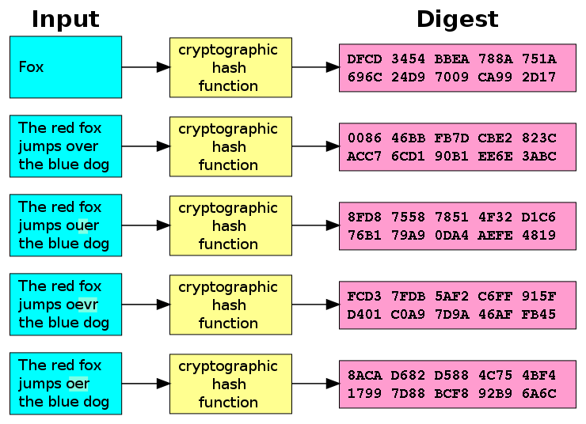
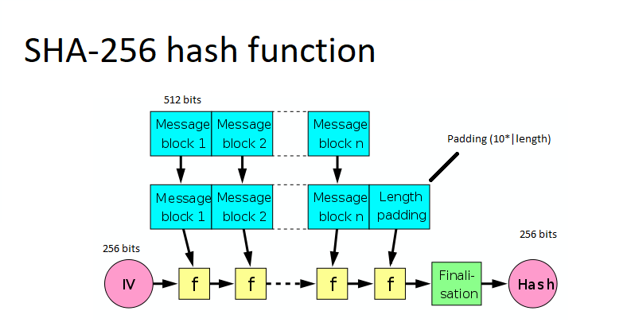

### Aim
 In this experiment, the user will learn about a **Practical Demonstration** (Application) of blockchain.
### Theory
 <h3>What is Blockchain Technology?</h3>
                     A blockchain is basically a living list of records, called as "blocks". These blocks are connected to each other by the diverse cryptographic mechanisms. In the category of data structures, this can be related to the concept of a Linked List. In Blockchain, the initial block is known as the "Genesis Block". This naming convention is basically a major commendation to Satoshi Nakamoto. The domain of crypto-currency was pioneered by a bogus naming convention. It can be related to a random scenario of a person or a group of persons, represented by a peculiar name “Satoshi Nakamoto”. In the year 2008, for the purpose of Bitcoin this name was utilized. The technology that was used behind the Bitcoin spectrum was “Block-Chain”. Initially the structure of a block has basically 3 components namely data, hash of current block and hash of previous block. 
As an illustration in general, the concept of block-chain can be depicted with “m” blocks forming a chain where m can be any random positive integer.  
<h3>Three pillars of blockchain</h3>
                    <h4>Decentralization</h4> The true meaning of decentralization is not having a central unit. Now if we take this concept in Blockchain it means that blockchain 
                   is autonomous and does not have a central governing unit.
                   <h4>Transparency</h4>Transparency in real life means something with zero opacity. Now if we take this concept in Blockchain, it means that blockchain
                    has zero privacy to be exact when we talk about transactions, all the transactions are public and can be viewed by anyone on the network.
                    <h4>Immutability</h4>Here immutable means exactly what the  word means in any real life i.e. something that cannnot be altered. So when we talk about 
                    blockchain it means that once a transaction is pushed into blockchain it cannot be altered.
                    
<h3>Elements of Blockchain</h3>
                     <h4>Smart-Contracts in Blockchain</h4>
The origin of the Smart-Contract began in the early 1990's by a versatile computer scientist "Nick Szabo". He is also an expert of the cryptographic domain. With the help of this concept, the user or anyone can avoid the  frauds of a middle men. It can allow anyone to trade currency, property or any valuable thing in a hassle-free manner. The user can compare it with a concept of C-Language i.e. "if-else statement". Same here happens, If one condition is fulfilled,then a particular condition will take place and if a particular condition is not met then, some other task will take place. The smart contracts are commited as codes. That simply means that, when an outline of an event takes place the smart contracts are triggered. For example, if in a corporate private organization, the targets are reached then the bonus will be given to the employees. Here, the bonus is basically the process happened when the code of target is completed. Syntactically, the principle is "if/when....then...", that means if a particular condition is met then a particular action will take place.
<h3>Advantages of Smart Contracts</h3>
There are basically 5 benifits of Smart Contracts that are discussed below: 
1.  Pace 
2.  Correctness 
3.  Belief 
4.  Certainty 
5.  Economizing    
                     <h4>Consensus Model</h4> This model basically deals with the soundness as well as safety of the blockchain. The primitive condition to be followed for this is to be consistent across the shared state.
                     Consensus is a vital approach because without a medial power, the users must follow the protocols and how to solicit them.
                     <h4>Public & Private Blockchain </h4>In general any transaction is pushed to the public blockchain where user is not known. A blockchain which is owned 
                     by a  enterprise/company is called a private blockchain here user is known. Private blockchain is comparatively faster than public blockchain because of less users. 
                       
<h3>How Does Blockchain Technology Work?</h3>
                     Decentralization, Transparency, Immutability are the three pillars of blockchain technology. Efficiency as well as cost can be optimised using this approach. The use as well as request of softwares or applications that are made  on blockchain architecture will only advance. A hash can be compared with a fingerprint (that is totally unique). A very popular cryptographic approach that is Secure Hash Algorithm (256) is used to formulate the hash value. Hash Value is basically the amalgamation of the numeric and the alphabetical data. This generation of hash is the primitive approach to understand blockchain. At that instant,when a block is generated, a hash has been produced for the same, and if any change has been done in the block, it will certainly affect the hash value too. With the mechanism of hashing, the changes are easily identified.
                     The ultimate verdict within the block is the hash value from a predecessor. Fortunately, by the means of this a chain of blocks is created that is the strategy behind blockchain's architecture.
                       
                     <h3>Mining </h3>
                   In terms of the block chain domain, mining is the procedure of appending transactions to an enormous distributed ledger of extant transactions. This concept is well suited for the bitcoin approach but the diverse technologies that uses the block chain approach can also perform the approach of mining as well. It allows the creation of a hash for a block of transactions that cannot be changed easily protecting the integrity approach of the block chain. The concept of mining goes really well with the other two approaches that are open ledger and distributed ledger.
                   Miners keep the blockchain consistent, complete, and unalterable by repeatedly grouping newly broadcast transactions into a block, which is then broadcast to the network and verified by recipient nodes. Each block contains a SHA-256 cryptographic hash of the previous block,thus linking it to the previous block and giving the blockchain its name.  

<h3>Some Basic Algorithmic Rules Used</h3>
<h3>What is SHA-256 and ECDSA?</h3>
                    SHA-256 or Secure Hash Algorithm-256 bit is a type of hash function which is commonly used in Blockchain. SHA-256 changes an input from the user to a string which is a mixture of numbers and letter which is created through a cryptographically secure hashing function which is almost 0% similar to the input. SHA-256 is the strongest hash function available in the current scenario and it is a successor of SHA-1. 
                    Eg:- SHA-256 hash of 'abc' will be 'ba7816bf­8f01cfea­414140de­5dae2223­b00361a3­96177a9c­b410ff61­f20015ad' 
                    ECDSA stands for Elliptic Curve Digital Signature Algorithm. ECDSA consists of three parts. 
                    &#9679;&nbsp;Private Key 
                    &#9679;&nbsp;Public Key 
                    &#9679;&nbsp;Signature  
                    <b>Private Key :- </b>It is a number in form of secret key which is known only to the person who owns it and does transactions. Private Key is a randomly generated number which is a single unsigned 256 bit integer. 
                    <b>Public Key :- </b>It is a number generated from Private Key but is not kept secret. A public Key can be determined from Private Key but Private Key cannot be determined from Public Key. A Public Key can be used to determine whether a Signature is genuine or not without requiring Private Key. 
                    <b>Signature :- </b>It is a number that confirms about a signing operation taking place. A Signature is a mathematically generated hash of the signed number and Priavte Key. A Public Key is used to determine whether the signature entered is genuine or not which provides security to the transactions.  
                      
                     
<h3>What Is a Consensus Mechanism?</h3>
                    A consensus mechanism is a fault-tolerant mechanism that is used in computer and blockchain systems to achieve the necessary
                    agreement on a single data value or a single state of the network among distributed processes or multi-agent systems, 
                    such as with cryptocurrencies. It is useful in record-keeping, among other things.
<h4>Proof of Work</h4>
                     This consensus algorithmic rule deals with the prevention of raw facts & figures, in blocks from tampering. By this mechanism, the blocks can be appended into a chain in a perpetual manner. Hashing as well as linking are the domains of safety in blockchain. A brief idea, of the hashing algorithmic rules have been understood by the user in the previous experiment (experiment no.2). For appending the blocks in the blockchain, the miners are provided with some tricky mathematical puzzles. The first miner to solve the puzzle, gets a reward that is based on some policy. One must understand that there should be enough computational power to solve that tricky mathematical puzzle.
                     After the solving of the puzzle, the blocks get added to chain thus forming blockchain. 
                     Proof of work is a consensus algorithm in blockchain technology. In Blockchain, miners use this algorithm to confirm transactions and create new blocks in the blockchain. With proof of work, miners try and compete against others to confirm the transaction in less time to get rewarded. For that miners have to solve a complex mathematical puzzle. 
                     Bitcoin is the most famous application of proof of work. In Blockchain it takes 10 minutes for the creation of Blockchain. 
<h4>Proof of Stake</h4>
                     It is an alternative measure to the Proof of Work (Pow). To achieve the objective of the distributed consensus this algorithmic rule can be used. In this mechanism, the validation of blocks takes place. PoS is somehow, less risky in comparison to the other protocol mentioned. Everything under this mechanism, holds a principle that “Proportions of Coins held by the miner”. The Proof of Stake (PoS) seeks to address this issue by attributing mining power to the proportion of coins held by a miner. This way, instead of utilizing energy to answer PoW puzzles, a PoS miner is limited to mining a percentage of transactions that is reflective of his or her ownership stake.With a PoS, the attacker would need to obtain 51% of the cryptocurrency to carry out a 51% attack. The Proof of Stake avoids this by making it disadvantageous for a miner with a 51% stake in a cryptocurrency to attack the network.
                      
<h4>Nonce</h4>
                    A nonce is an arbitrary number used only once in a cryptographic communication, in the spirit of a nonce word. They are often random or pseudo-random numbers. Many nonces also include a timestamp to ensure exact timeliness, though this requires clock synchronization between organizations. The addition of a client nonce ("cnonce") helps to improve the security in some ways as implemented in digest access authentication. To ensure that a nonce is used only once, it should be time-variant (including a suitably fine-grained timestamp in its value), or generated with enough random bits to ensure a probabilistically insignificant chance of repeating a previously generated value. Some authors define pseudo-randomness (or unpredictability) as a requirement for a nonce.
                     

### Procedure
<h4>Steps of simulator </h4> 
                        1. Start with the task regarding concepts of Blockchain. 
                        2. Click on the word that you want to be inserted. 
                        3. Click on the blank where the previously entered word is to be inserted. 
                        4. After filling all the words click on validate  button. 
                        5. Click in the hint button to get the hint of the wrong question if any and repeat the above process to get all the right answers. 
                        6. Click on the "Initiate Blockchain" button to go to the experiment page.  
                        7. Now select the Hash Difficulty Level from the dropdown menu on the simulator this will set the number of zeroes before the hash 
                        and increase the time taken by miner to calcutlate the hash so if you don't have much time, it is advised to keep it below 3. 
                        8. After that enter the data in the data field this will inavalidate the block hence creating an error in blockchain.  
                        9. Now click on the "Mine" button to generate valid hash regarding the entered value and then start the proces of mining. 
                        10. The instruction pane will also be there to make the user understand about the basic process that is happening in the simulator.  
                       
                        
### Pre Test
1. First block include previous hash or not?
                         
                        A.<input type="radio" name="but" id="rb11" onclick="click1();">&nbsp;Yes 
                         
                        B.<input type="radio" name="but" id="rb12" onclick="click1();">&nbsp;**No**
                         
                        C.<input type="radio" name="but" id="rb13" onclick="click1();">&nbsp;Can't say
                         
                        

                         
2. Which of the folowing algorithm is used in the hashing?
                         
                        A.<input type="radio" name="but" id="rb11" onclick="click1();">&nbsp;Kadane’s algorithm
                         
                        B.<input type="radio" name="but" id="rb12" onclick="click1();">&nbsp;Lee algorithm
                         
                        C.<input type="radio" name="but" id="rb13" onclick="click1();">&nbsp;**SHA-256**
                         
                        D.<input type="radio" name="but" id="rb14" onclick="click1();">&nbsp;None of the above
                         
                        

                         
3. What does the hashing function does?
                         
                        A.<input type="radio" name="but" id="rb11" onclick="click1();">&nbsp;Sorts the entered array
                         
                        B.<input type="radio" name="but" id="rb12" onclick="click1();">&nbsp;**Converts an input string into encrypted output of fixed length**
                         
                        C.<input type="radio" name="but" id="rb13" onclick="click1();">&nbsp;Both A and B
                         
                        D.<input type="radio" name="but" id="rb14" onclick="click1();">&nbsp;None of the Above
                         
                        

                         
4. What is a nonce?
                         
                        A.<input type="radio" name="but" id="rb11" onclick="click1();">&nbsp;Hashing algorithm
                         
                        B.<input type="radio" name="but" id="rb12" onclick="click1();">&nbsp;A random number
                         
                        C.<input type="radio" name="but" id="rb13" onclick="click1();">&nbsp;A variable to be entered in the formula
                         
                        D.<input type="radio" name="but" id="rb14" onclick="click1();">&nbsp;**Both B and C**
                         
                        

                         
5.  What is the term for when a blockchain splits?
                         
                        A.<input type="radio" name="but" id="rb11" onclick="click1();">&nbsp;**A fork**
                         
                        B.<input type="radio" name="but" id="rb12" onclick="click1();">&nbsp;A merge
                         
                        C.<input type="radio" name="but" id="rb13" onclick="click1();">&nbsp;A sidechain
                         
                        D.<input type="radio" name="but" id="rb14" onclick="click1();">&nbsp;A division
                         
                        

                         
6. What is the process of creating new bitcoins popularly known as?
                         
                        A.<input type="radio" name="but" id="rb11" onclick="click1();">&nbsp;Finding
                         
                        B.<input type="radio" name="but" id="rb12" onclick="click1();">&nbsp;Panning
                         
                        C.<input type="radio" name="but" id="rb13" onclick="click1();">&nbsp;Sourcing
                         
                        D.<input type="radio" name="but" id="rb14" onclick="click1();">&nbsp;**Mining**
                         
                        

                         
7. Which of the following is important for Blockchain?
                         
                        A.<input type="radio" name="but" id="rb11" onclick="click1();">&nbsp;Database Security
                         
                        B.<input type="radio" name="but" id="rb12" onclick="click1();">&nbsp;Auditing
                         
                        C.<input type="radio" name="but" id="rb13" onclick="click1();">&nbsp;***Planning**
                         
                        D.<input type="radio" name="but" id="rb14" onclick="click1();">&nbsp;None of the above
                         
                        

                         

### Post Test
1. What do you mean by hash difficulty level?
                         
                        A.<input type="radio" name="but" id="rb11" onclick="click1();">&nbsp;Its depends on the time to calculate hash
                         
                        B.<input type="radio" name="but" id="rb12" onclick="click1();">&nbsp;**The difficulty level denotes the amount of 0's, the hash should start with**
                         
                        C.<input type="radio" name="but" id="rb13" onclick="click1();">&nbsp;both A and B
                         
                        D.<input type="radio" name="but" id="rb14" onclick="click1();">&nbsp;None of the above
                         
                        

                         
2. What are the different types of Blockchains?
                         
                        A.<input type="radio" name="but" id="rb11" onclick="click1();">&nbsp;Public
                         
                        B.<input type="radio" name="but" id="rb12" onclick="click1();">&nbsp;Consortium
                         
                        C.<input type="radio" name="but" id="rb13" onclick="click1();">&nbsp;Private
                         
                        D.<input type="radio" name="but" id="rb14" onclick="click1();">&nbsp;**All of the above**
                         
                        

                         
3. What is the work of nonce in blockchain?
                         
                        A.<input type="radio" name="but" id="rb11" onclick="click1();">&nbsp;Count transaction money
                         
                        B.<input type="radio" name="but" id="rb12" onclick="click1();">&nbsp;**Value set by miners to make the hash equal to or less than the target of the network**
                         
                        C.<input type="radio" name="but" id="rb13" onclick="click1();">&nbsp;None of the above
                         
                        

                         
4. What is the initial application for which Blockchain was designed?
                         
                        A.<input type="radio" name="but" id="rb11" onclick="click1();">&nbsp;Peer-to-peer finance application
                         
                        B.<input type="radio" name="but" id="rb12" onclick="click1();">&nbsp;Research Project
                         
                        C.<input type="radio" name="but" id="rb13" onclick="click1();">&nbsp;Open source finance software to connect Banks
                         
                        D.<input type="radio" name="but" id="rb14" onclick="click1();">&nbsp;**None of these**
                         
                        

                         
5. Why Blockchain can be trusted?
                         
                        A.<input type="radio" name="but" id="rb11" onclick="click1();">&nbsp;Its compatibility with other business applications due to its open-source nature.
                         
                        B.<input type="radio" name="but" id="rb12" onclick="click1();">&nbsp;Its security
                         
                        C.<input type="radio" name="but" id="rb13" onclick="click1();">&nbsp;**both A and B**
                         
                        D.<input type="radio" name="but" id="rb14" onclick="click1();">&nbsp;None of the above
                         
                        

                         
6.  In blockchain, blocks are linked ________?
                         
                        A.<input type="radio" name="but" id="rb11" onclick="click1();">&nbsp;**Backward to the previous block**
                         
                        B.<input type="radio" name="but" id="rb12" onclick="click1();">&nbsp;Forward to next block
                         
                        C.<input type="radio" name="but" id="rb13" onclick="click1();">&nbsp;Both A and B
                         
                        D.<input type="radio" name="but" id="rb14" onclick="click1();">&nbsp;Not linked with each other
                         
                        

                         
7. How can you identify Block?
                         
                        A.<input type="radio" name="but" id="rb11" onclick="click1();">&nbsp;by the block header Hash 
                         
                        B.<input type="radio" name="but" id="rb12" onclick="click1();">&nbsp;by the block height
                         
                        C.<input type="radio" name="but" id="rb13" onclick="click1();">&nbsp;**Both A and B**
                         
                        D.<input type="radio" name="but" id="rb14" onclick="click1();">&nbsp;None of the above
                         
                        

                         
                        

### References

                         
                        1. Draft version of “S. Shukla, M. Dhawan, S. Sharma, S. Venkatesan, ‘Blockchain Technology: Cryptocurrency and Applications’, Oxford University Press, 2019. 
                        2. Josh Thompson, ‘Blockchain: The Blockchain for Beginnings, Guild to Blockchain Technology and Blockchain Programming’, Create Space Independent Publishing Platform, 2017 
                        3. Hassan, F. U., Ali, A., Latif, S., Qadir, J., Kanhere, S., Singh, J., & Crowcroft, J. (2019). Blockchain And The Future of the Internet: A Comprehensive Review.
<h3>Webliography </h3>
                         
                        1.&nbsp;https://github.com/anders94/blockchain-demo
                         
                        2.&nbsp;https://anders.com/blockchain/
                         
                        3.&nbsp;https://blockgeeks.com/guides/what-is-blockchain-technology/
                         
                        4.&nbsp;https://shecancode.io/blog/an-introduction-to-blockchain-distributed-ledgers
                         
                        5.&nbsp;https://www.coindesk.com/information/ethereum-smart-contracts-work
                         
                        6.&nbsp;https://mlsdev.com/blog/156-how-to-build-your-own-blockchain-architecture
                         
                        7.&nbsp;http://www.conceptfound.com/Misunderstandings-of-Blockchain
                         
                        8.&nbsp;https://www.coindesk.com/information/what-is-a-decentralized-application-dapp
                         
                        9.&nbsp;https://mlsdev.com/blog/156-how-to-build-your-own-blockchain-architecture
                         
                        10.&nbsp;https://www.business-case-analysis.com/ledger.html
                         
                        11.&nbsp;https://data-flair.training/blogs/blockchain-quiz-test-knowledge/ 
                        12.&nbsp;https://uk.wikipedia.org/wiki/%D0%A4%D0%B0%D0%B9%D0%BB:Merkle-Damgard_hash_big.svg 
                        13.&nbsp;https://medium.com/cryptoadvance/ecdsa-is-not-that-bad-two-party-signing-without-schnorr-or-bls-1941806ec36f 
                        14.&nbsp;https://www.capgemini.com/2019/02/why-there-is-so-much-fuss-around-consensus-model-in-blockchain/ 
                        15.&nbsp;https://blockgeeks.com/guides/smart-contracts/ 
                        16.&nbsp;https://github.com/Savjee/SavjeeCoin  
                        17.&nbsp;https://en.wikipedia.org/wiki/Cryptographic_nonce#Definition
                        18.&nbsp;https://data-flair.training/blogs/blockchain-terminologies/  