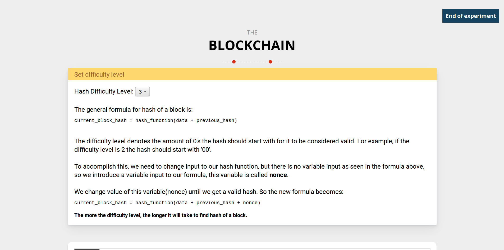
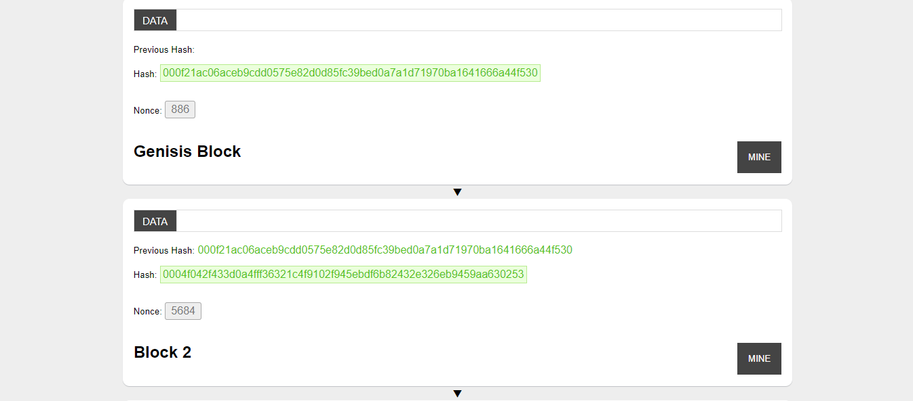
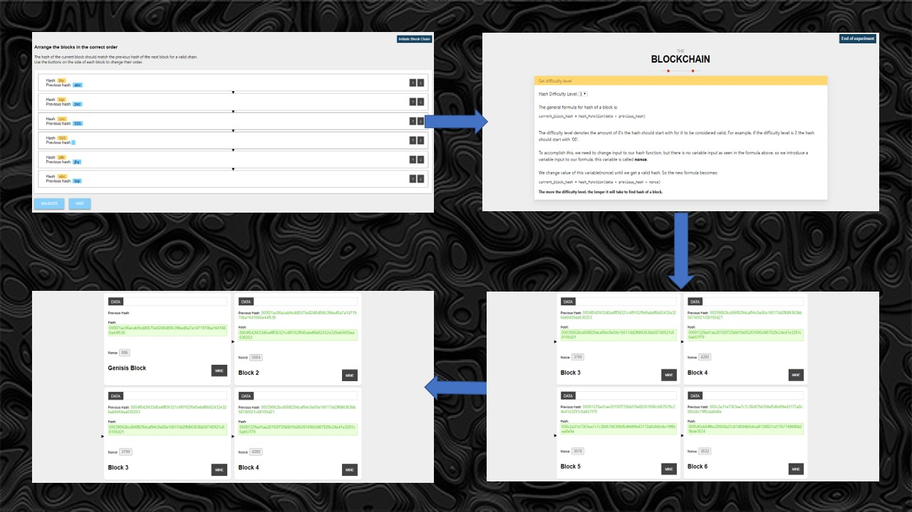
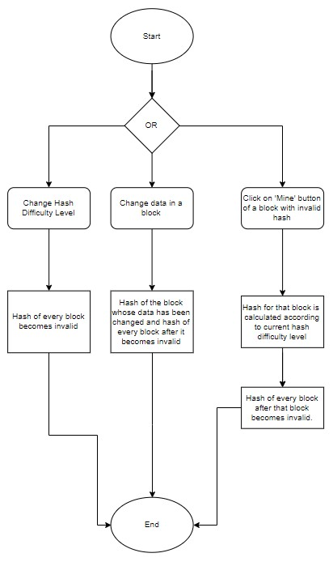
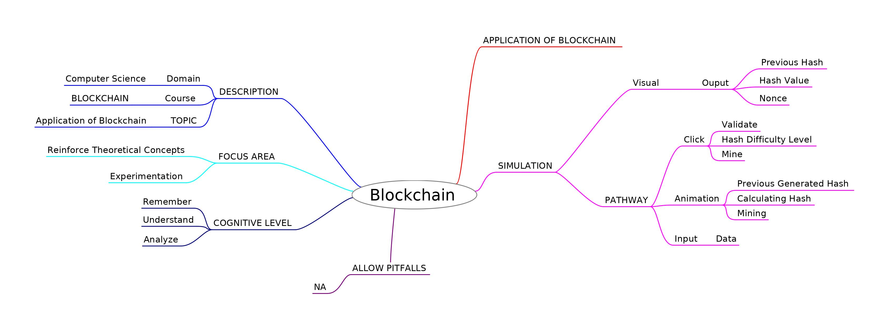
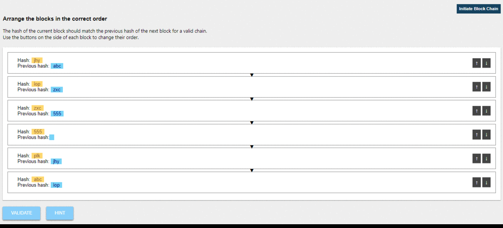

# Round 2

## Experiment 5: Application of Blockchain

### 1. Story Outline :

 The user lands into a page where he/she is set to perform a task where he/she has to fill in blanks according to the questions asked regarding Application of Blockchain. After he/she has completed the task, he/she moves to the next page of the simulator where he/she 
understand a real life application of Blockchain.  

### 2. Story :

The experiment demonstrates the application of Blockchain in real world. 
First the data is being entered by the user. Hash value is generated according to the data entered. Then when the user moves to the next block checks the previous hash and the hash in the second block is calculated accordingly.  

### Page 1
 

### Page 2

#### 2.1 Set the Visual Stage Description:
<h2>Construction of the set-up:</h2>

For better visualization, a simulator is provided. There is a need to illustrate the application of Blockchain. Since,
performing this experiment in real life is not economically feasible, so a simulator can always be the 
best alternative. A proper animated environment is given for better understanding of the procedure. First a task on Application of Blockchain is represented to recall user's knowledge on hashing. Then 
an interactive and animated simulation is performed so that user can understand the application of Blockchain.  

#### 2.2 Set User Objectives & Goals:
Sr No. |    Learning Objective  | Cognitive Level
:--|:--|:-:
1.| User will be able to:  User will be able to: Recall the concept of Blockchain by  selecting the correct words to fill the blanks provided. | Remember 
2.| User will be able to:  Describe how the blockchain works in real time. | Understand
3.| User will be able to:  Describe how change in one block can invalidate whole chain. | Understand
4.| User will be able to:  Describe what is the use of nonce difficulty. | Understand
5.| User will be able to:  Experiment with hashing with SHA-256 in real time. | Apply
 

#### 2.3 Set the Pathway Activities:

The simulator tab is divided into three main sections:  
In first section we allow the user : 
To recall his previous knowledge on Blockchain.  
In the second section user : 
Will enter the data of their choice and a Hash will be generated according to the data entered.  

#### Pathway Illustration

##### 2.4 Set Challenges and Questions/Complexity/Variations in Questions:

Assessment Questions: 
Task 1: Understanding Application of Blockchain. 
Question: How does mining process work??  
Task 2:  Understandning Hashing. 
Question: How a Hash is generated from the data entered.  
Task 3: Ananlyzing Hash. 
Quewstion: How are previous Hash connected to previous Block? 

####2.5 Allow Pitfall:
1.We have only one data field to simulate the data in a block, whereas in real world generally a block contains multiple entries of data(transactions in case of cryptocurrencies).
2.On higher hash difficulty levels, the amount of time required to calculate the hash of a block is very high, and may result in the user getting bored. 

#### 2.5 Conclusion:
<dd>In this experiment, the user has learned about real world Application of Blockchain. The user understands how Hash in Blockchain is generated in real life scenario. In this the user enteres the data and a Hash is generated accordingly. Previous Hash of the next block is same as the hash generated from the data of the previous block.
</dd>

#### 2.5.1 Assesment:

It takes approx 15 minutes for an untrained user to completly understand and analyse the simulator.
And about 10 minutes for a trained user to completly understand and analyze the simulator.
Average =(15+10)/2= 12.5 minutes(Simulator is in testing/developing stage)

#### 2.6 Equations/Formulas:

#### Some of the equations used in the simulator:

#### i. SHA-256

 

#### ii. ECDSA (Elliptic Curve Digital Signature Algorithm)

### 3. Flowchart

### 4. Mindmap

 
### 5. Storyboard 

 