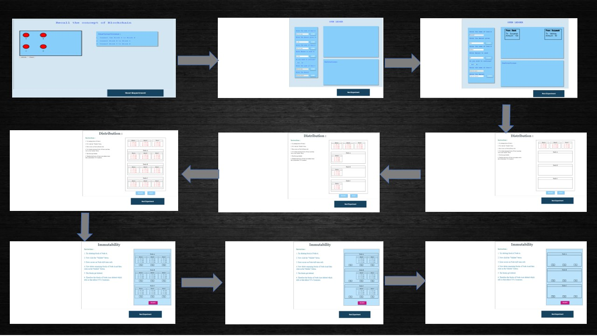

### Aim
In this experiment, the user will learn about Blockchain and its three pillars that are 
decentralization, transparency & immutability. The simulator will also demonstrate the relation between blocks and chain. Apart from that,
he/she will also be able to explain and apply the concepts of blockchain with the help of open and distributed ledger.
### Theory
 <h3>What is Blockchain Technology?</h3>
                     A blockchain is basically a living list of records, called as "blocks". These blocks are connected to each other by the diverse cryptographic mechanisms. In the category of data structures, this can be related to the concept of a Linked List. In Blockchain, the initial block is known as the "Genesis Block". This naming convention is basically a major commendation to Satoshi Nakamoto. The domain of crypto-currency was pioneered by a bogus naming convention. It can be related to a random scenario of a person or a group of persons, represented by a peculiar name “Satoshi Nakamoto”. In the year 2008, for the purpose of Bitcoin this name was utilized. The technology that was used behind the Bitcoin spectrum was “Block-Chain”. Initially the structure of a block has basically 3 components namely data, hash of current block and hash of previous block. 
As an illustration in general, the concept of block-chain can be depicted with “m” blocks forming a chain where m can be any random positive integer.  
<h3>Three pillars of blockchain</h3>
                    <h4>Decenttralization</h4> The true meaning of decentralization is not having a central unit. Now if we take this concept in Blockchain it means that blockchain 
                   is autonomous and does not have a central governing unit.
                   <h4>Transparency</h4>Transparency in real life means something with zero opacity. Now if we take this concept in Blockchain, it means that blockchain
                    has zero privacy to be exact when we talk about transactions, all the transactions are public and can be viewed by anyone on the network.
                    <h4>Immutability</h4>Here immutable means exactly what the  word means in any real life i.e. something that cannnot be altered. So when we talk about 
                    blockchain it means that once a transaction is pushed into blockchain it cannot be altered.
                    
<h3>Elements of Blockchain</h3>
                     <h4>Smart Contract</h4> With the help of this concept, the user or anyone can avoid the  frauds of a middle men. It can allow anyone to trade currency, property or any valuable thing in a hassle-free manner. The user can compare it with a concept of C-Language i.e. "if-else statement". Same here happens, If one condition is fulfilled,then a particular condition will take place and if a particular condition is not met then, some other task will take place. The smart contracts are commited as codes. That simply means that, when an outline of an event takes place the smart contracts are triggered. For example, if in a corporate private organization, the targets are reached then the bonus will be given to the employees. Here, the bonus is basically the process happened when the code of target is completed.   
                     <h4>Consensus Model</h4> This model basically deals with the soundness as well as safety of the blockchain. The primitive condition to be followed for this is to be consistent across the shared state.
                     Consensus is a vital approach because without a medial power, the users must follow the protocols and how to solicit them.
                     <h4>Public & Private Blockchain </h4>In general any transaction is pushed to the public blockchain where user is not known. A blockchain which is owned 
                     by a  enterprise/company is called a private blockchain here user is known. Private blockchain is comparatively faster than public blockchain because of less users. 
                       
<h3>How Does Blockchain Technology Work?</h3>
                     Decentralization, Transparency, Immutability are the three pillars of blockchain technology. Efficiency as well as cost can be optimised using this approach. The use as well as request of softwares or applications that are made  on blockchain architecture will only advance. A hash can be compared with a fingerprint (that is totally unique). A very popular cryptographic approach that is Secure Hash Algorithm (256) is used to formulate the hash value. Hash Value is basically the amalgamation of the numeric and the alphabetical data. This generation of hash is the primitive approach to understand blockchain. At that instant,when a block is generated, a hash has been produced for the same, and if any change has been done in the block, it will certainly affect the hash value too. With the mechanism of hashing, the changes are easily identified.
                     The ultimate verdict within the block is the hash value from a predecessor. Fortunately, by the means of this a chain of blocks is created that is the strategy behind blockchain's architecture.
                       
                     
### Procedure
<h4>Steps of simulator </h4> 
                        1.&nbsp;User will perform a task by clicking on the blocks to connect them in the correct order. And then verifying his/her answer by clicking on 'validate' button. 
                        2.&nbsp;Click on the Next Experiment button to proceed to the experiment page. 
                        3.&nbsp;To Understand the concept of open ledger, Enter the Name and Amount of the sender as well as the recipient in the placeholder.  
                        4.&nbsp;Click on the Submit button to complete the details of a particular user. Complete the same process for the next user.  
                        5.&nbsp;In the canvas section, the illustration will take place according to the inputs given by the user.  
                        6.&nbsp;Click on the Next Experiment button to proceed further.  
                        7.&nbsp;The next section is of Distributed ledger where the concept of decentralization is implemented.  
                        8.&nbsp;Click on the desired block in the ledger, then click on the desired user where you need to place that block.  
                        9.&nbsp;The same process is done for the next two users.  
                        10.&nbsp;Click on the validate button to validate your transaction. 
                        11.&nbsp;The next concept is of immutability, where the user wil click on the toggle button, to display or delete a block. 
                        12.&nbsp;Click on the validate button to complete the concept of Immutability. 
                        13.&nbsp;The instruction pane will also be there to make the user understand about the basic process that is happening in the simulator.  
                        

### Pre Test
1. What is a blockchain?
                         
                        A.<input type="radio" name="but" id="rb11" onclick="click1();">&nbsp;A type of cryptocurrency
                         
                        **B**.<input type="radio" name="but" id="rb12" onclick="click1();">&nbsp;**A distributed ledger on a peer to peer network**
                         
                        C.<input type="radio" name="but" id="rb13" onclick="click1();">&nbsp;An exchange
                         
                        D.<input type="radio" name="but" id="rb14" onclick="click1();">&nbsp;A centralized ledger
                         
                        

                         
 2. Who invented Blockchain?
                         
                        A. <input type="radio" name="but2" id="rb21" onclick="click2();">&nbsp;Samsung
                         
                        B. <input type="radio" name="but2" id="rb22" onclick="click2();">&nbsp;John Mcafee
                         
                        **C**. <input type="radio" name="but2" id="rb23" onclick="click2();">&nbsp;**Satoshi Nakamoto**
                         
                        D. <input type="radio" name="but2" id="rb24" onclick="click2();">&nbsp;None of these
                          
                        

                         
 
 3. What is a miner?
                         
                        A. <input type="radio" name="but4" id="rb41" onclick="click4();">&nbsp;A type of blockchain
                         
                        B. <input type="radio" name="but4" id="rb42" onclick="click4();">&nbsp;A person doing calculations to verify a transaction
                         
                        **C**. <input type="radio" name="but4" id="rb43" onclick="click4();">&nbsp;**Computers that validate and process blockchain transactions**
                         
                        D. <input type="radio" name="but4" id="rb44" onclick="click4();">&nbsp;An algorithm that predicts the next part of the chain
                          
                        

                         
4. What is a genesis block?
                        
                        A. <input type="radio" name="but3" id="rb31" onclick="click3();">&nbsp;A famous block that hardcoded a hash of the Book of Genesis onto the blockchain
                         
                        B. <input type="radio" name="but3" id="rb32" onclick="click3();">&nbsp;The 2nd transaction of a Blockchain
                         
                        **C**. <input type="radio" name="but3" id="rb33" onclick="click3();">&nbsp;**The first block of a Blockchain**
                         
                        D. <input type="radio" name="but3" id="rb34" onclick="click3();">&nbsp;None of the above
                          
                        

                         
5. According to the blockchain mechanism, which statement is true?
                         
                        **A**.<input type="radio" name="but" id="rb11" onclick="click1();">&nbsp;**All the people receive transactions simultaneously**
                         
                        B.<input type="radio" name="but" id="rb12" onclick="click1();">&nbsp;Only the person taking part receives the transaction
                         
                        C.<input type="radio" name="but" id="rb13" onclick="click1();">&nbsp;Both are correct
                         
                        D.<input type="radio" name="but" id="rb14" onclick="click1();">&nbsp;None of these
                         
                        

                         

 
                     
    
### Post Test
1. Which of these statements are true for open ledger?
                         
                        A.<input type="radio" name="but" id="rb11" onclick="click1();">&nbsp;Every one has copy of ledger
                         
                        **B**.<input type="radio" name="but" id="rb12" onclick="click1();">&nbsp;**Ledger can be viewed by anyone**
                         
                        C.<input type="radio" name="but" id="rb13" onclick="click1();">&nbsp;Ledger is mutable
                         
                        D.<input type="radio" name="but" id="rb14" onclick="click1();">&nbsp;None of these
                         
                        

                         
 2. Which of the following is true for distributed ledger?
                         
                        **A**. <input type="radio" name="but2" id="rb21" onclick="click2();">&nbsp;**Everyone has a copy of ledger****
                         
                        B. <input type="radio" name="but2" id="rb22" onclick="click2();">&nbsp;There is one copy of the ledger
                         
                        C. <input type="radio" name="but2" id="rb23" onclick="click2();">&nbsp;Ledger is mutable
                         
                        D. <input type="radio" name="but2" id="rb24" onclick="click2();">&nbsp;None of these
                          
                        

                         
 
 3. A miner has completed the minning what will be the next step?
                         
                        A. <input type="radio" name="but4" id="rb41" onclick="click4();">&nbsp;Wait for second miner to complete
                         
                        B. <input type="radio" name="but4" id="rb42" onclick="click4();">&nbsp;Wait for all members to complete
                         
                        **C**. <input type="radio" name="but4" id="rb43" onclick="click4();">&nbsp;**Validate the transaction and add it to the ledger**
                         
                        D. <input type="radio" name="but4" id="rb44" onclick="click4();">&nbsp;None of these
                          
                        

                         
4. Which of the following listed is a ledger in blockchain?
                        
                        A. <input type="radio" name="but3" id="rb31" onclick="click3();">&nbsp;Distributed Ledger
                         
                        B. <input type="radio" name="but3" id="rb32" onclick="click3();">&nbsp;Open Ledger
                         
                        **C**. <input type="radio" name="but3" id="rb33" onclick="click3();">&nbsp;**Both a and b**
                         
                        D. <input type="radio" name="but3" id="rb34" onclick="click3();">&nbsp;None of these
                          
                        

                         
5. How can a user successfully modify a blockchain?
                         
                        A. <input type="radio" name="but4" id="rb41" onclick="click4();">&nbsp;It is immutable
                         
                        B. <input type="radio" name="but4" id="rb42" onclick="click4();">&nbsp;By simply deleting the block
                         
                        **C**. <input type="radio" name="but4" id="rb43" onclick="click4();">&nbsp;**By use of consensus algorithm**
                         
                        D. <input type="radio" name="but4" id="rb44" onclick="click4();">&nbsp;None of these
                          
                        

                         

### References

                         
                        1. Draft version of “S. Shukla, M. Dhawan, S. Sharma, S. Venkatesan, ‘Blockchain Technology: Cryptocurrency and Applications’, Oxford University Press, 2019. 
                        2. Josh Thompson, ‘Blockchain: The Blockchain for Beginnings, Guild to Blockchain Technology and Blockchain Programming’, Create Space Independent Publishing Platform, 2017 
                        3. Hassan, F. U., Ali, A., Latif, S., Qadir, J., Kanhere, S., Singh, J., & Crowcroft, J. (2019). Blockchain And The Future of the Internet: A Comprehensive Review.
<h3>Webliography </h3>
                         
                        1.&nbsp;https://github.com/anders94/blockchain-demo
                         
                        2.&nbsp;https://anders.com/blockchain/
                         
                        3.&nbsp;https://blockgeeks.com/guides/what-is-blockchain-technology/
                         
                        4.&nbsp;https://shecancode.io/blog/an-introduction-to-blockchain-distributed-ledgers
                         
                        5.&nbsp;https://www.coindesk.com/information/ethereum-smart-contracts-work
                         
                        6.&nbsp;https://mlsdev.com/blog/156-how-to-build-your-own-blockchain-architecture
                         
                        7.&nbsp;http://www.conceptfound.com/Misunderstandings-of-Blockchain
                         
                        8.&nbsp;https://www.coindesk.com/information/what-is-a-decentralized-application-dapp
                         
                        9.&nbsp;https://mlsdev.com/blog/156-how-to-build-your-own-blockchain-architecture
                         
                        10.&nbsp;https://www.business-case-analysis.com/ledger.html
                         
                        11.&nbsp;https://data-flair.training/blogs/blockchain-quiz-test-knowledge/ 
                        12.&nbsp;https://uk.wikipedia.org/wiki/%D0%A4%D0%B0%D0%B9%D0%BB:Merkle-Damgard_hash_big.svg 
                        13.&nbsp;https://medium.com/cryptoadvance/ecdsa-is-not-that-bad-two-party-signing-without-schnorr-or-bls-1941806ec36f 
                        14.&nbsp;https://www.capgemini.com/2019/02/why-there-is-so-much-fuss-around-consensus-model-in-blockchain/ 
                        15.&nbsp;https://blockgeeks.com/guides/smart-contracts/ 
                        16.&nbsp;https://github.com/Savjee/SavjeeCoin
                         

