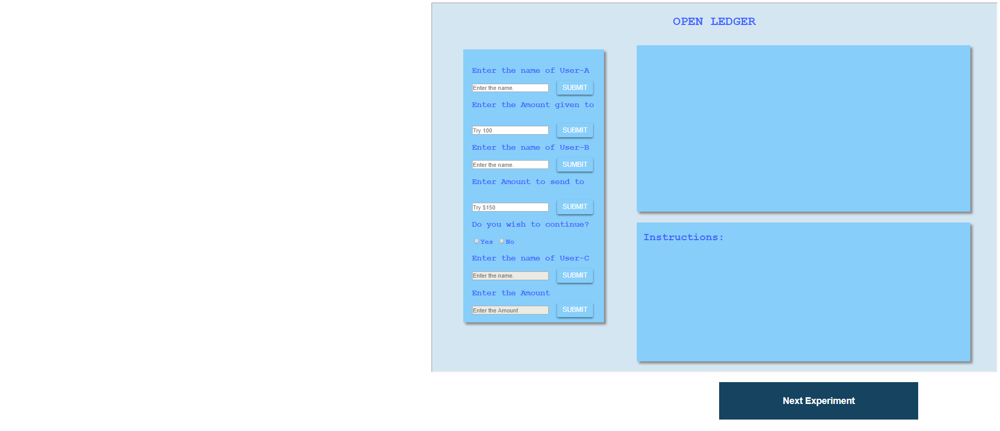
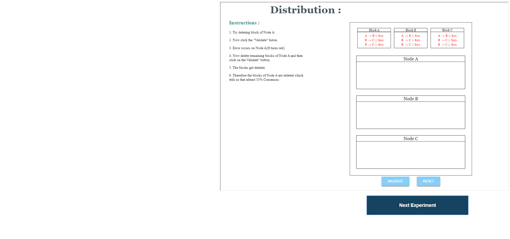
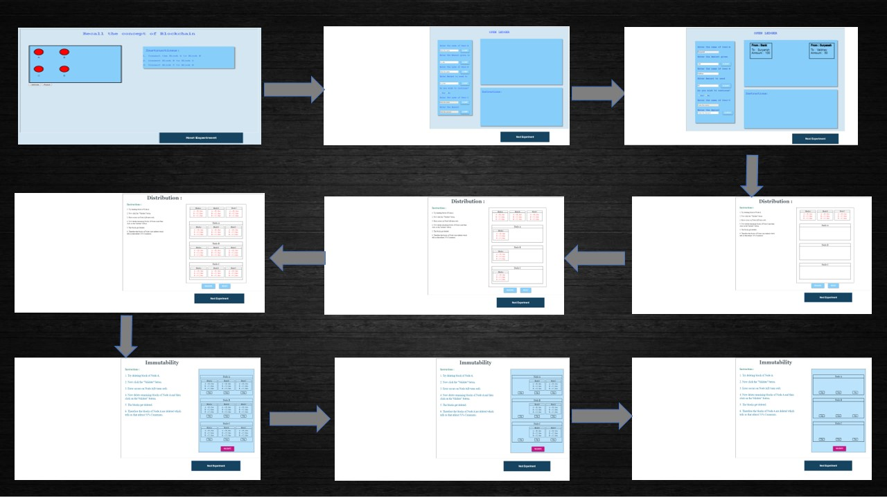
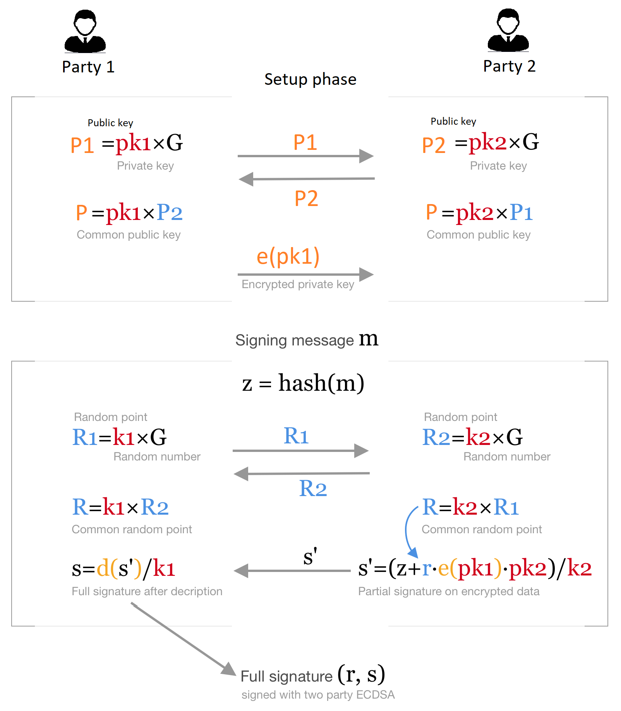
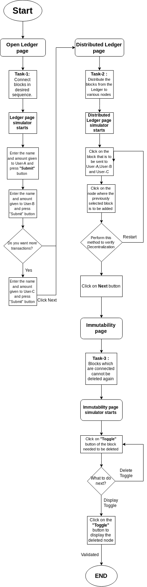
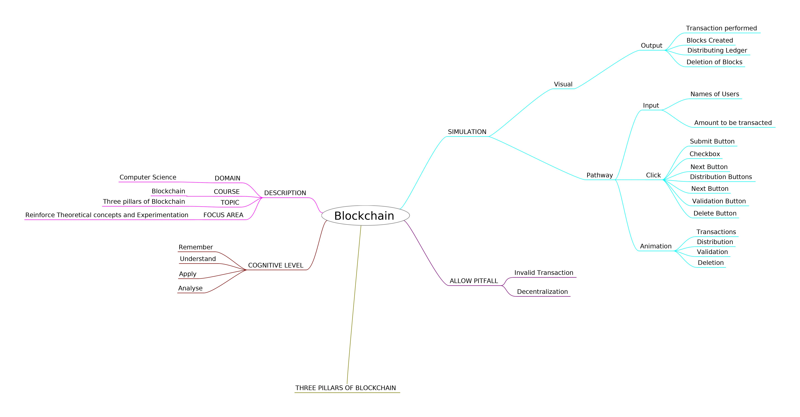
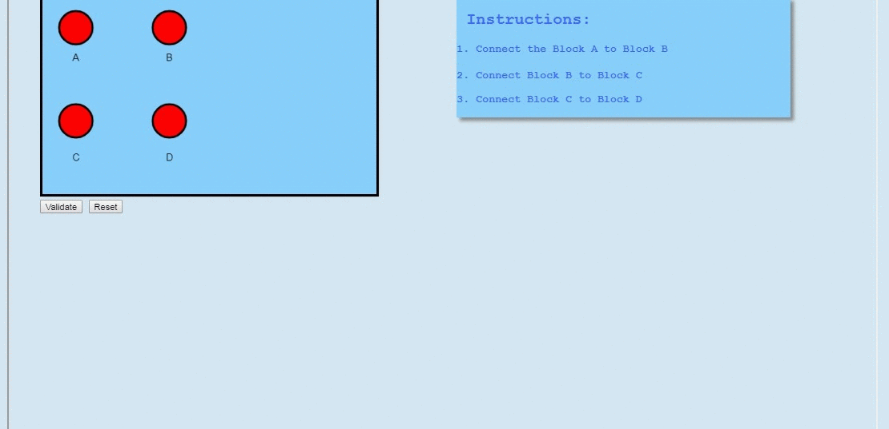

# Round 2

**Experiment 1: Three pillars to Blockchain**

### 1. Story Outline :

 The user lands into the simulator and it demonstrates the following scenario. Initially the user has to perform the task to recall the concept of Blockchain. Then with an interactive task,user learns about the open ledger then user moves on to the Distributed Ledger. After that user will perform task on Distributed Ledger followed by concept of Immutability in Blockchain.  

### 2. Story :

The experiment demonstrates three pillars of Blockchain namely Decentralization, Transparency and Immutability. The creation of Blockchain is depicted by showing transactions through Ledger.  The concept of Distributed Ledger is depicted in the second phase where it illustrates how a valid transaction is distributed among all users.  The third phase is depicting the concept of Immutability which is the main feature of the Blockchain.  

### Page 1
 

### Page 2

#### 2.1 Set the Visual Stage Description:
<h2>Construction of the set-up:</h2>

For better visualization, a simulator is provided. There is a need of physical significance for teaching Blockchain. Since, performing this experiment in real life is not feasible because of privacy issues, a simulator can always be the best alternative. A proper animated environment is given for better understanding of the procedure. Three pillars of Blockchain namely (Decentralization, Transparency and Immutability) are performed one by one for deeper understanding of the concept. 

#### 2.2 Set User Objectives & Goals:
Sr. No |	Learning Objective	| Cognitive Level 
:--|:--|:--|
1.| User will be able to:  Recall concept of Blockchain by connecting the blocks in the desired sequence. | Remember 
2.| User will be able to:  Describe how blocks and chains are created using  Ledger(Open and distributed Ledger). | Understand
3.| User will be able to:  Construct Distributed Ledger using Open Ledger. | Apply 
4.| User will be able to:  Analyze the concept of Immutability (Deletion) using Distributed Ledger.| Analyse

</b>

#### 2.3 Set the Pathway Activities:

The simulator tab is divided into three main sections: 
In first section we allow the user : 
To add blocks by providing required information about it, which will then get linked to form a ledger. 

In the second section user : 

Will distribute the given blocks among the users to create a distributed ledger. 

In the third section user : 

Will try to delete the blocks from the given ledger and check the validity of his actions. 

#### Pathway Illustration

##### 2.4 Set Challenges and Questions/Complexity/Variations in Questions:

Assessment Questions: 
Task 1: Understanding decentralization of blockchain. 

Question : Why is open ledger distributed among all the users instead of keeping it with single entity? 

Task 2 : Understanding Immutability of blockchain. 

Question : What is the required algorithm or concept used to make the blockchain immutable? 

Task 3 : To understand Transparency of blockchain. 

Question : Why do you think the concept of blockchain is used in cryptocurrencies ? 

#### 2.5 Allow Pitfalls:
1. Ideally, the amount transferred to user-B by user-A should be less than that user-A has, but if the user enters the amount greater than the amount user-A has,it creates an error in blockchain.
2. Ideally, User has to send block-1 to all the users(A,B......) and after that he/she can send another block i.e block-2 to all users. If this property is not followed, then simulator comes up with  an alert of whats wrong with his distribution then he would  correct his mistakes and tries till he succeeds in valid distribution of ledger. Hence, the User understands the concept of decentralization in blockchain. 
3. Ideally, User has to perform a valid deletion of blocks from the given distributed ledger to verify the concept Immutability but when user performs invalid deletions simulator illustrates what has been done wrong and then user corrects his mistake and hence learns how the deletion in blockchain works.
#### 2.6 Conclusion:
<dd>In this experiment, the user has learned about the three pillars of Blockchain namely Decentralization,Transparency and Immutability. The user is able to understand the concept of Blockchain, its creation as well as how it is applied. In addition to that, he/she is be able to apply the concept of Open Ledger to create a Distributed Ledger. And also he/she is able to understand how transaction are distributed among all users. Now, the validation and deletion are also performed to understand the concept of Blockchain, its creation as well as how it is applied.
</dd>

#### 2.6.1 Assesment:

It takes approx 15 minutes for a untrained user to completly understand and analyse the simulator.
And about 8 minutes for a trained user to completly understand and analyze the simulator.
Average =(15+8)/2= 11.5 minutes(Simulator is in testing/developing stage)

#### 2.7 Equations/Formulas:

#### Some of the equations used in the simulator:

#### SHA-256

 

#### ECDSA (Elliptic Curve Digital Signature Algorithm)

### 3. Flowchart

### 4. Mindmap

 
### 5. Storyboard 

 
