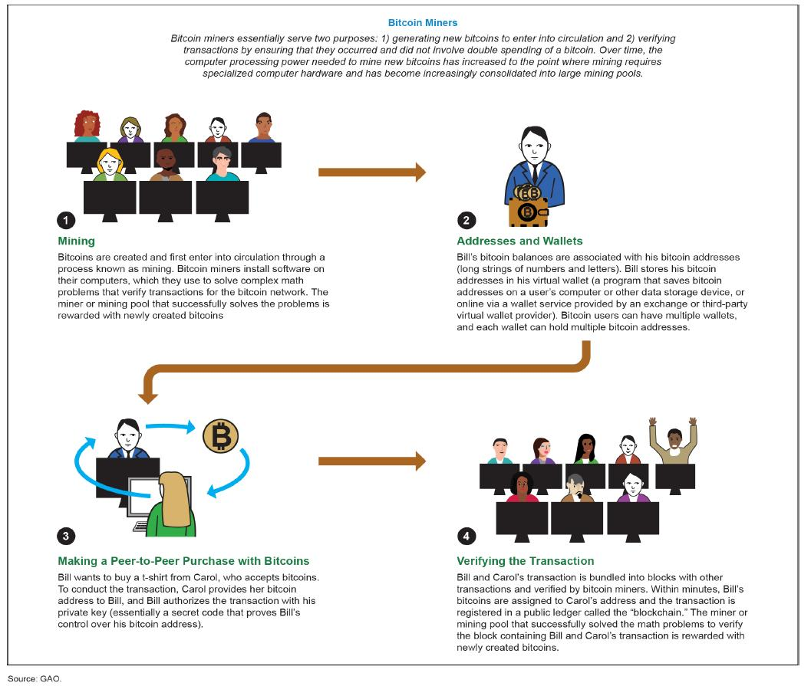
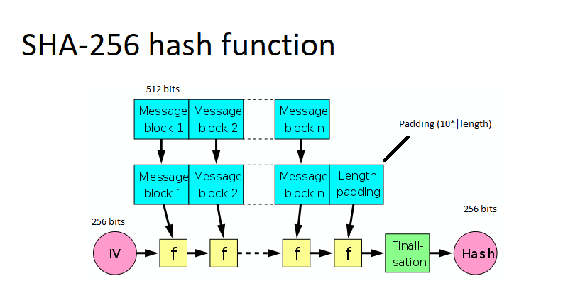
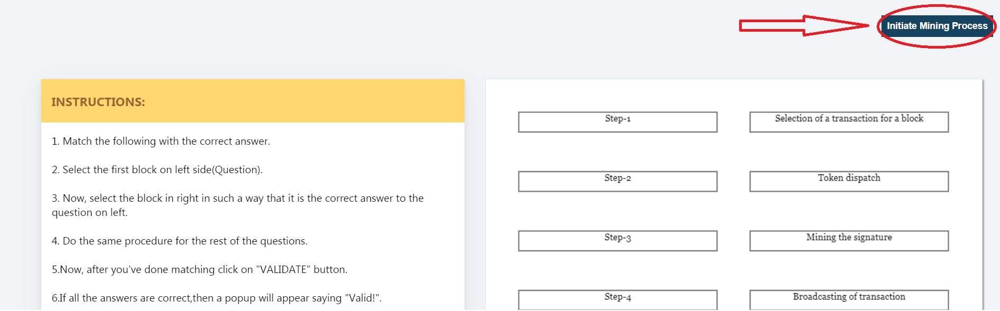
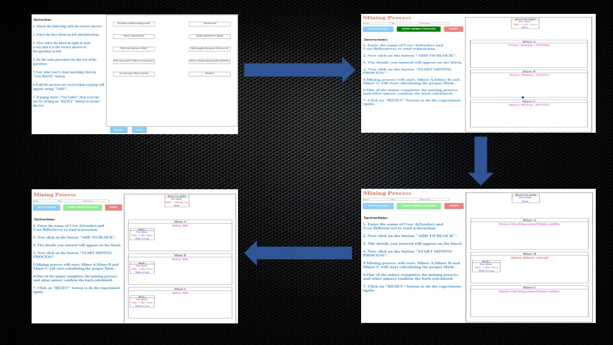

### Aim
In this experiment, the user will learn about mining in blockchain i.e. how a transaction is validated and added into a blockchain.
    He/she will learn how the process of hashing helps in validation of a block.He/she will also get to know which miner is rewarded when a block is validated and added to the blockchain.
### Theory
 <h3>What is Blockchain Technology?</h3>
                     A blockchain is basically a living list of records, called as "blocks". These blocks are connected to each other by the diverse cryptographic mechanisms. In the category of data structures, this can be related to the concept of a Linked List. In Blockchain, the initial block is known as the "Genesis Block". This naming convention is basically a major commendation to Satoshi Nakamoto. The domain of crypto-currency was pioneered by a bogus naming convention. It can be related to a random scenario of a person or a group of persons, represented by a peculiar name “Satoshi Nakamoto”. In the year 2008, for the purpose of Bitcoin this name was utilized. The technology that was used behind the Bitcoin spectrum was “Block-Chain”. Initially the structure of a block has basically 3 components namely data, hash of current block and hash of previous block. 
As an illustration in general, the concept of block-chain can be depicted with “m” blocks forming a chain where m can be any random positive integer.  
<h3>How Does Blockchain Technology Work?</h3>
                     Decentralization, Transparency, Immutability are the three pillars of blockchain technology. Efficiency as well as cost can be optimised using this approach. The use as well as request of softwares or applications that are made  on blockchain architecture will only advance. A hash can be compared with a fingerprint (that is totally unique). A very popular cryptographic approach that is Secure Hash Algorithm (256) is used to formulate the hash value. Hash Value is basically the amalgamation of the numeric and the alphabetical data. This generation of hash is the primitive approach to understand blockchain. At that instant,when a block is generated, a hash has been produced for the same, and if any change has been done in the block, it will certainly affect the hash value too. With the mechanism of hashing, the changes are easily identified.
                     The ultimate verdict within the block is the hash value from a predecessor. Fortunately, by the means of this a chain of blocks is created that is the strategy behind blockchain's architecture.
                       
<h3>Mining </h3>
                   In terms of the block chain domain, mining is the procedure of appending transactions to an enormous distributed ledger of extant transactions. This concept is well suited for the bitcoin approach but the diverse technologies that uses the block chain approach can also perform the approach of mining as well. It allows the creation of a hash for a block of transactions that cannot be changed easily protecting the integrity approach of the block chain. The concept of mining goes really well with the other two approaches that are open ledger and distributed ledger.
                   Miners keep the blockchain consistent, complete, and unalterable by repeatedly grouping newly broadcast transactions into a block, which is then broadcast to the network and verified by recipient nodes. Each block contains a SHA-256 cryptographic hash of the previous block,thus linking it to the previous block and giving the blockchain its name.  
                     
<h3>What is SHA-256 and ECDSA?</h3>
                    SHA-256 or Secure Hash Algorithm-256 bit is a type of hash function which is commonly used in Blockchain. SHA-256 changes an input from the user to a string which is a mixture of numbers and letter which is created through a cryptographically secure hashing function which is almost 0% similar to the input. SHA-256 is the strongest hash function available in the current scenario and it is a successor of SHA-1. 
                    Eg:- SHA-256 hash of 'abc' will be 'ba7816bf­8f01cfea­414140de­5dae2223­b00361a3­96177a9c­b410ff61­f20015ad' 
                    ECDSA stands for Elliptic Curve Digital Signature Algorithm. ECDSA consists of three parts. 
                    &#9679;&nbsp;Private Key 
                    &#9679;&nbsp;Public Key 
                    &#9679;&nbsp;Signature  
                    <b>Private Key :- </b>It is a number in form of secret key which is known only to the person who owns it and does transactions. Private Key is a randomly generated number which is a single unsigned 256 bit integer. 
                    <b>Public Key :- </b>It is a number generated from Private Key but is not kept secret. A public Key can be determined from Private Key but Private Key cannot be determined from Public Key. A Public Key can be used to determine whether a Signature is genuine or not without requiring Private Key. 
                    <b>Signature :- </b>It is a number that confirms about a signing operation taking place. A Signature is a mathematically generated hash of the signed number and Priavte Key. A Public Key is used to determine whether the signature entered is genuine or not which provides security to the transactions.  
                      
                     
<h3>Three pillars of blockchain</h3>
                    <h4>Decenttralization</h4> The true meaning of decentralization is not having a central unit. Now if we take this concept in Blockchain it means that blockchain 
                   is autonomous and does not have a central governing unit.
                   <h4>Transparency</h4>Transparency in real life means something with zero opacity. Now if we take this concept in Blockchain, it means that blockchain
                    has zero privacy to be exact when we talk about transactions, all the transactions are public and can be viewed by anyone on the network.
                    <h4>Immutability</h4>Here immutable means exactly what the  word means in any real life i.e. something that cannnot be altered. So when we talk about 
                    blockchain it means that once a transaction is pushed into blockchain it cannot be altered.
                    
<h3>Elements of Blockchain</h3>
                     <h4>Smart Contract</h4> With the help of this concept, the user or anyone can avoid the  frauds of a middle men. It can allow anyone to trade currency, property or any valuable thing in a hassle-free manner. The user can compare it with a concept of C-Language i.e. "if-else statement". Same here happens, If one condition is fulfilled,then a particular condition will take place and if a particular condition is not met then, some other task will take place. The smart contracts are commited as codes. That simply means that, when an outline of an event takes place the smart contracts are triggered. For example, if in a corporate private organization, the targets are reached then the bonus will be given to the employees. Here, the bonus is basically the process happened when the code of target is completed.   
                     <h4>Consensus Model</h4> This model basically deals with the soundness as well as safety of the blockchain. The primitive condition to be followed for this is to be consistent across the shared state.
                     Consensus is a vital approach because without a medial power, the users must follow the protocols and how to solicit them.
                     <h4>Public & Private Blockchain </h4>In general any transaction is pushed to the public blockchain where user is not known. A blockchain which is owned 
                     by a  enterprise/company is called a private blockchain here user is known. Private blockchain is comparatively faster than public blockchain because of less users. 
                       
                     
### Procedure

<h4>Steps of simulator </h4> 
                        1.&nbsp;Start with the task regarding Mining concept(User can skip if he/she wants). 
                         
                        2.&nbsp;To Understand the concept of Mining, Enter the Name and Amount (Cryptocurrency) of the sender as well as the recipient in the placeholder.  
                        3.&nbsp;Click on the 'Add to block' button to complete the details of a particular user. As soon as the button is clicked, the details will get added to the block.  
                        4.&nbsp;In the canvas section, the illustration will take place according to the inputs given by the user. 
                        5.&nbsp;Complete the same process for the next user.  
                        6.&nbsp;Click on the start mining process button, to start the mining process. 
                7.&nbsp;Click on the reset button to reset all the details that were entered by the user. 
                8.&nbsp;The instruction pane will also be there to make the user understand about the basic process that is happening in the simulator.   
                       
                        
### Pre Test
1. Which key is used for Asymmetric Cryptography?
                         
                        A.<input type="radio" name="but" id="rb11" onclick="click1();">&nbsp;Public Key
                         
                        B.<input type="radio" name="but" id="rb12" onclick="click1();">&nbsp;Private Key
                         
                        C.<input type="radio" name="but" id="rb13" onclick="click1();">&nbsp;Both public and private keys
                         
                        D.<input type="radio" name="but" id="rb14" onclick="click1();">&nbsp;None of the above
                         
                        

                         
 2. The full form of SHA is?
                         
                        A. <input type="radio" name="but2" id="rb21" onclick="click2();">&nbsp;Social Hash Algorithm
                         
                        B. <input type="radio" name="but2" id="rb22" onclick="click2();">&nbsp;Secure Hash Algorithm
                         
                        C. <input type="radio" name="but2" id="rb23" onclick="click2();">&nbsp;System Hash Algorithm
                         
                        D. <input type="radio" name="but2" id="rb24" onclick="click2();">&nbsp;None of the above
                          
                        

                         
 
 3. Which of the following is a full form of P2P?
                         
                        A. <input type="radio" name="but4" id="rb41" onclick="click4();">&nbsp;Peer to Peer
                         
                        B. <input type="radio" name="but4" id="rb42" onclick="click4();">&nbsp;Public key to Public key
                         
                        C. <input type="radio" name="but4" id="rb43" onclick="click4();">&nbsp;Private key to Public key
                         
                        D. <input type="radio" name="but4" id="rb44" onclick="click4();">&nbsp;None of the above
                          
                        

                         
4. Where can you reserve your cryptocurrrency?
                        
                        A. <input type="radio" name="but3" id="rb31" onclick="click3();">&nbsp;Rerserve Bank of India
                         
                        B. <input type="radio" name="but3" id="rb32" onclick="click3();">&nbsp;Wallet
                         
                        C. <input type="radio" name="but3" id="rb33" onclick="click3();">&nbsp;Compact Disk (CD)
                         
                        D. <input type="radio" name="but3" id="rb34" onclick="click3();">&nbsp;Both and b
                          
                        

                         
5. Identify the correct statement?
                         
                        A.<input type="radio" name="but" id="rb11" onclick="click1();">&nbsp;Blockchain is centralized
                         
                        B.<input type="radio" name="but" id="rb12" onclick="click1();">&nbsp;Blockchain is mutable
                         
                        C.<input type="radio" name="but" id="rb13" onclick="click1();">&nbsp;Both a and b
                         
                        D.<input type="radio" name="but" id="rb14" onclick="click1();">&nbsp;None of the above
                         
                        

                         
6. What is a miner?
                        
                        A. <input type="radio" name="but3" id="rb31" onclick="click3();">&nbsp;A type of blockchain
                         
                        B. <input type="radio" name="but3" id="rb32" onclick="click3();">&nbsp;An algorithm that predicts the next part of the chain
                         
                        C. <input type="radio" name="but3" id="rb33" onclick="click3();">&nbsp;A person doing calculations to verify a transaction
                         
                        D. <input type="radio" name="but3" id="rb34" onclick="click3();">&nbsp;Computers that validate and process blockchain transactions
                          
                        

                         
7. What is the process of creating new bitcoins popularly known as?
                        
                        A. <input type="radio" name="but3" id="rb31" onclick="click3();">&nbsp;Finding
                         
                        B. <input type="radio" name="but3" id="rb32" onclick="click3();">&nbsp;Panning
                         
                        C. <input type="radio" name="but3" id="rb33" onclick="click3();">&nbsp;Sourcing
                         
                        D. <input type="radio" name="but3" id="rb34" onclick="click3();">&nbsp;Mining
                          
                        

                         
 
 
                     
    

### Post Test
1. Which statement is correct?
                         
                        A.<input type="radio" name="but" id="rb11" onclick="click1();">&nbsp;Mining is a process of adding transactions in a ledger 
                         
                        B.<input type="radio" name="but" id="rb12" onclick="click1();">&nbsp;SHA-256 is the only cryptographic algorithm used in blockchain
                         
                        C.<input type="radio" name="but" id="rb13" onclick="click1();">&nbsp;Both a and b
                         
                        D.<input type="radio" name="but" id="rb14" onclick="click1();">&nbsp;None of the above
                         
                        

                         
 2. Which is not an advantage of blockchain technology?
                         
                        A. <input type="radio" name="but2" id="rb21" onclick="click2();">&nbsp;Anonymity & Privacy
                         
                        B. <input type="radio" name="but2" id="rb22" onclick="click2();">&nbsp;Mutability
                         
                        C. <input type="radio" name="but2" id="rb23" onclick="click2();">&nbsp;Low transaction cost
                         
                        D. <input type="radio" name="but2" id="rb24" onclick="click2();">&nbsp;Digital freedom and decntralization
                          
                        

                         
 
 3. Initial miner has completed the mining process, what will be the next step?
                         
                        A. <input type="radio" name="but4" id="rb41" onclick="click4();">&nbsp;Wait for the next miner to complete
                         
                        B. <input type="radio" name="but4" id="rb42" onclick="click4();">&nbsp;Terminate the process
                         
                        C. <input type="radio" name="but4" id="rb43" onclick="click4();">&nbsp;Validate the transaction and add it to the ledger
                         
                        D. <input type="radio" name="but4" id="rb44" onclick="click4();">&nbsp;None of the above
                          
                        

                         
4. Which of the following listed is not involved in mining?
                        
                        A. <input type="radio" name="but3" id="rb31" onclick="click3();">&nbsp;Hash Value 
                         
                        B. <input type="radio" name="but3" id="rb32" onclick="click3();">&nbsp;Hash function
                         
                        C. <input type="radio" name="but3" id="rb33" onclick="click3();">&nbsp;Sender and Reciever
                         
                        D. <input type="radio" name="but3" id="rb34" onclick="click3();">&nbsp;None of the above
                          
                        

                         
5. Which statement is not correct?
                         
                        A. <input type="radio" name="but4" id="rb41" onclick="click4();">&nbsp;Mining is not done in blockchain
                         
                        B. <input type="radio" name="but4" id="rb42" onclick="click4();">&nbsp;Ledger is related to the process of mining
                         
                        C. <input type="radio" name="but4" id="rb43" onclick="click4();">&nbsp;Both a and b
                         
                        D. <input type="radio" name="but4" id="rb44" onclick="click4();">&nbsp;None of the above
                          
                        

                         
6. The block in the blockchain consist of?
                         
                        A. <input type="radio" name="but4" id="rb41" onclick="click4();">&nbsp;A hash pointer to the previous block
                         
                        B. <input type="radio" name="but4" id="rb42" onclick="click4();">&nbsp;Timestamp
                         
                        C. <input type="radio" name="but4" id="rb43" onclick="click4();">&nbsp;List of transactions
                         
                        D. <input type="radio" name="but4" id="rb44" onclick="click4();">&nbsp;All of the above
                          
                        

                         
7. The main advantage of immutability is_________.
                         
                        A. <input type="radio" name="but4" id="rb41" onclick="click4();">&nbsp;Scalability
                         
                        B. <input type="radio" name="but4" id="rb42" onclick="click4();">&nbsp;Improved Security
                         
                        C. <input type="radio" name="but4" id="rb43" onclick="click4();">&nbsp;Tamper Proof
                         
                        D. <input type="radio" name="but4" id="rb44" onclick="click4();">&nbsp;Increased Efficiency 
                          
                        

                                                 

### References

                         
                        1. Draft version of “S. Shukla, M. Dhawan, S. Sharma, S. Venkatesan, ‘Blockchain Technology: Cryptocurrency and Applications’, Oxford University Press, 2019. 
                        2. Josh Thompson, ‘Blockchain: The Blockchain for Beginnings, Guild to Blockchain Technology and Blockchain Programming’, Create Space Independent Publishing Platform, 2017 
                        3. Hassan, F. U., Ali, A., Latif, S., Qadir, J., Kanhere, S., Singh, J., & Crowcroft, J. (2019). Blockchain And The Future of the Internet: A Comprehensive Review.
<h3>Webliography </h3>
                         
                        1.&nbsp;https://github.com/anders94/blockchain-demo
                         
                        2.&nbsp;https://anders.com/blockchain/
                         
                        3.&nbsp;https://blockgeeks.com/guides/what-is-blockchain-technology/
                         
                        4.&nbsp;https://shecancode.io/blog/an-introduction-to-blockchain-distributed-ledgers
                         
                        5.&nbsp;https://www.coindesk.com/information/ethereum-smart-contracts-work
                         
                        6.&nbsp;https://mlsdev.com/blog/156-how-to-build-your-own-blockchain-architecture
                         
                        7.&nbsp;http://www.conceptfound.com/Misunderstandings-of-Blockchain
                         
                        8.&nbsp;https://www.coindesk.com/information/what-is-a-decentralized-application-dapp
                         
                        9.&nbsp;https://mlsdev.com/blog/156-how-to-build-your-own-blockchain-architecture
                         
                        10.&nbsp;https://www.business-case-analysis.com/ledger.html
                         
                        11.&nbsp;https://data-flair.training/blogs/blockchain-quiz-test-knowledge/ 
                        12.&nbsp;https://uk.wikipedia.org/wiki/%D0%A4%D0%B0%D0%B9%D0%BB:Merkle-Damgard_hash_big.svg 
                        13.&nbsp;https://medium.com/cryptoadvance/ecdsa-is-not-that-bad-two-party-signing-without-schnorr-or-bls-1941806ec36f 
                        14.&nbsp;https://www.capgemini.com/2019/02/why-there-is-so-much-fuss-around-consensus-model-in-blockchain/ 
                        15.&nbsp;https://blockgeeks.com/guides/smart-contracts/ 
                        16.&nbsp;https://github.com/Savjee/SavjeeCoin
                         
                        17.&nbsp;https://www.techopedia.com/definition/32530/mining-blockchain

