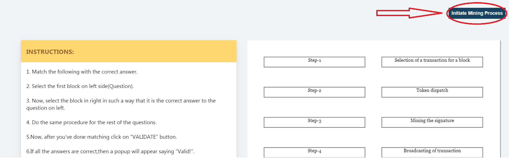

<h4>Steps of simulator </h4> 
                        1.&nbsp;Start with the task regarding concept of mining.(If previously known, otherwise skip) 
                                        
                        2. Match the following with the correct answer. 
                        3. Select the first block on left side(Step number). 
                        4. Now, select the block in right in such a way that it is the correct position on left. 
                        5. Do the same procedure for the rest of the steps. 
                        6. Now, after you've done matching click on "VALIDATE" button. 
                        7. If all the answers are correct,then a popup will appear saying "Valid!". 
                        8. If popup shows "Not Valid!" then reset the test by cicking on "RESET" button to restart the test. 
                        9. Now click on initiate mining process to go to the next part. 
                        10.&nbsp;Enter the Name and Amount (Cryptocurrency) of the sender as well as the recipient in the placeholder.  
                        11.&nbsp;Click on the 'Add to block' button to complete the details of a particular user. As soon as the button is clicked, the details will get added to the block.  
                        12.&nbsp;The illustration will take place according to the inputs given by the user. 
                        13.&nbsp;Complete the same process for the next user.  
                        14.&nbsp;Click on the start mining process button, to start the mining process. 
                15.&nbsp;Click on the reset button to reset all the details that were entered by the user. 
                16.&nbsp;The instruction pane will also be there to make the user understand about the basic process that is happening in the simulator.   