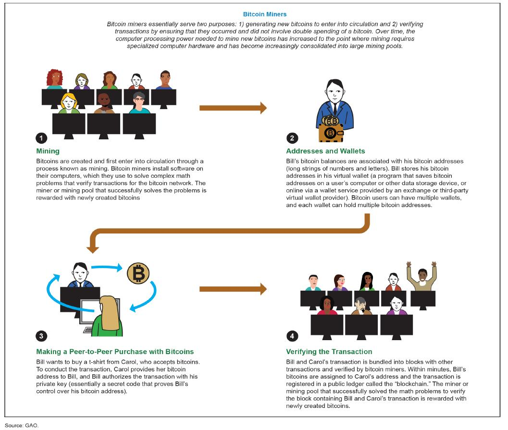

 <h3>Blockchain Technology</h3>
                     A blockchain is basically a living list of records, called as "blocks". These blocks are connected to each other by the diverse cryptographic mechanisms. In the category of data structures, this can be related to the concept of a Linked List. In Blockchain, the initial block is known as the "Genesis Block". This naming convention is basically a major commendation to Satoshi Nakamoto. The domain of crypto-currency was pioneered by a bogus naming convention. It can be related to a random scenario of a person or a group of persons, represented by a peculiar name “Satoshi Nakamoto”. In the year 2008, for the purpose of Bitcoin this name was utilized. The technology that was used behind the Bitcoin spectrum was “Block-Chain”. Initially the structure of a block has basically 3 components namely data, hash of current block and hash of previous block. 

<h3>Mining </h3>
                   In terms of the block chain domain, mining is the procedure of appending transactions to an enormous distributed ledger of extant transactions. This concept is well suited for the bitcoin approach but the diverse technologies that uses the block chain approach can also perform the approach of mining as well. It allows the creation of a hash for a block of transactions that cannot be changed easily protecting the integrity approach of the block chain. The concept of mining goes really well with the other two approaches that are open ledger and distributed ledger. 
 
 <h3>Some Basic Algorithmic Rules Used</h3>                   
<h3>SHA-256 and ECDSA</h3>
                    SHA-256 or Secure Hash Algorithm-256 bit is a type of hash function which is commonly used in Blockchain. SHA-256 changes an input from the user to a string which is a mixture of numbers and letter which is created through a cryptographically secure hashing function which is almost 0% similar to the input. SHA-256 is the strongest hash function available in the current scenario and it is a successor of SHA-1. 
                    Eg:- SHA-256 hash of 'abc' will be 'ba7816bf­8f01cfea­414140de­5dae2223­b00361a3­96177a9c­b410ff61­f20015ad' 
                    ECDSA stands for Elliptic Curve Digital Signature Algorithm. ECDSA consists of three parts. 
                    &#9679;Private Key 
                    &#9679;Public Key 
                    &#9679;Signature  
                    <b>Private Key :- </b>It is a number in form of secret key which is known only to the person who owns it and does transactions. Private Key is a randomly generated number which is a single unsigned 256 bit integer. 
                    <b>Public Key :- </b>It is a number generated from Private Key but is not kept secret. A public Key can be determined from Private Key but Private Key cannot be determined from Public Key. A Public Key can be used to determine whether a Signature is genuine or not without requiring Private Key. 
                    <b>Signature :- </b>It is a number that confirms about a signing operation taking place. A Signature is a mathematically generated hash of the signed number and Priavte Key. A Public Key is used to determine whether the signature entered is genuine or not which provides security to the transactions. 
                      
                     