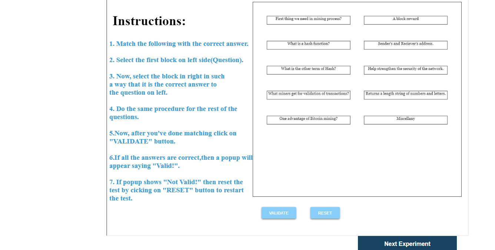
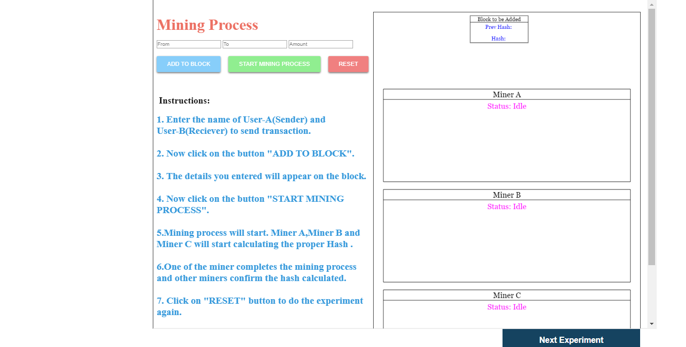
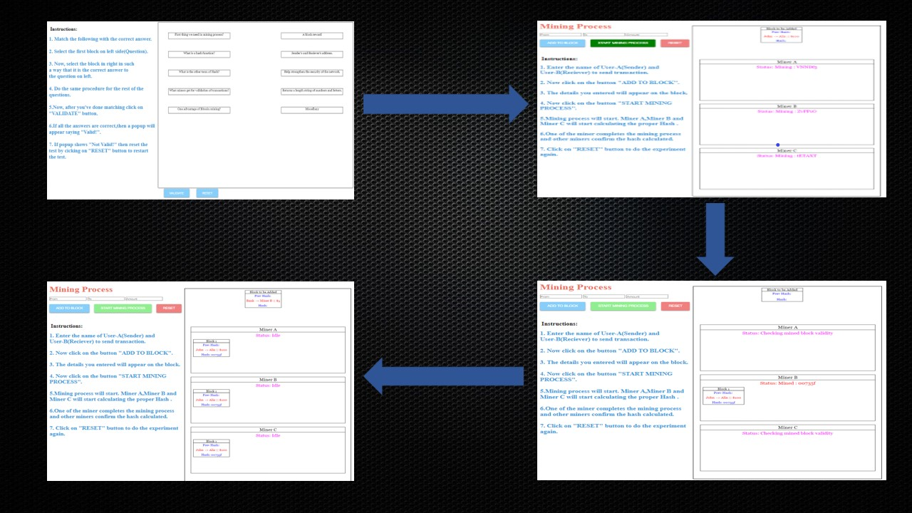
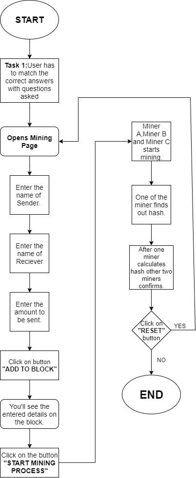
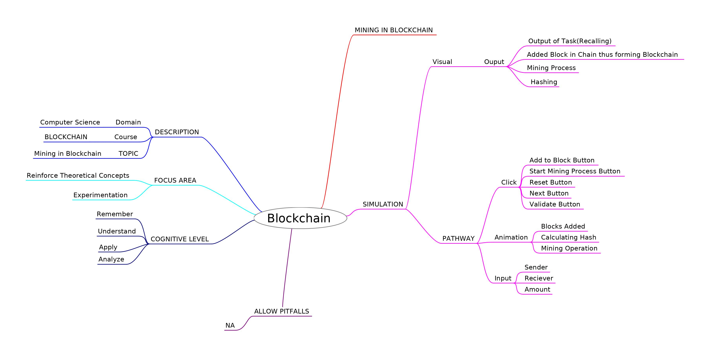
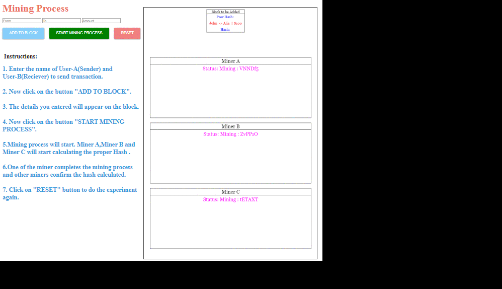

# Round 2

**Experiment 2: Mining in Blockchain**

### 1. Story Outline :

 The user lands into a page where he/she is set to perform a task where he has to match the steps in the corect order i.e. in 
which order they are executed in the mining process. After he/she has completed the task, he/she moves to the next page of the simulator where he/she 
performs a practical implementation of how mining is done in Blockchain.  

### 2. Story :

The experiment demonstrates the process of how a transaction is being processed and validated through the concept of Mining. 
First the details of the transaction is being entered by the user and added to the block. Then after that three miner namely "Miner A","Miner B" and "Miner C" starts
the mining process. One of the miner at random calculates the correct hash and after a short while other two miners confirm the hash and the transaction is completed.  

### Page 1
 

### Page 2

#### 2.1 Set the Visual Stage Description:
<h2>Construction of the set-up:</h2>

For better visualization, a simulator is provided. There is a need of illustrating what happens in mining exactly. Since,
performing this experiment in real life is not economically feasible because a mining rig is required to perform mining which is very expensive, so a simulator can always be the 
best alternative. A proper animated environment is given for better understanding of the procedure. First a task on mining to recall user's knowledge on mining. Then 
an interactive and animated simulation is performed so that  user can understand the process of mining.  

#### 2.2 Set User Objectives & Goals:
Sr No. |    Learning Objective  | Cognitive Level
:--|:--|:-:
1.| User will be able to:  Recall the concept of Mining by matching the steps of mining process in correct order. | Remember 
2.| User will be able to:  Describe how a transaction is validated and added  to the main blockchain. | Understand
3.| User will be able to:  Identify how the process of hashing is used in mining and what role does it play. | Apply
4.| User will be able to:  Analyze the concept of rewarding the miner i.e. the  miner who is first in calculating the hash and hence validating a block. | Analyse

#### 2.3 Set the Pathway Activities:

The simulator tab is divided into two main sections:  
In first section we allow the user : 
To recall his previous knowledge on mining.  
In the second section user : 
Will give required information about the transactions to be added in the block and then this block will be added to the blockchain after clicking on the 'Start mining process'. 

#### Pathway Illustration

##### 2.4 Set Challenges and Questions/Complexity/Variations in Questions:

Assessment Questions: 
Task 1: Understanding how a block is validated through mining. 

Question : How many miners work on mining at a time after block is ready to be pushed into the block? 

Task 2 : Getting to know how hashing algorithm is used in mining. 

Question : What is the hashing algorithm used in the process of mining? 

Task 3 : Understanding how and which miner  is rewarded after sucessfull addition of a block to blockchain. 

Question : When will the miner finally recieve the amount? 

#### 2.5 Allow Pitfalls:
1. User links the the two sides in the first task, but if the choices he linked are wrong they turn red and give the option of hint from where user can correct his mistakes and learns the right answers.

#### 2.6 Conclusion:
<dd>In this experiment, the user has learned about the mining concept of blockchain. The user has understood the concept of validation of Blocks and its addition to the enormous distributed ledger of extant transactions. The user has also understood the rewarding policy of mining in blockchain. In addition to that, he/she has also learned about various cryptographic functions.
</dd>

#### 2.6.1 Assesment:

It takes approx. 10 minutes for a untrained user to completly understand and analyse the simulator.
And about 5 minutes for a trained user to completly understand and analyze the simulator.
Average =(10+5)/2= 7.5 minutes(Simulator is in testing/developing stage)

#### 2.6 Equations/Formulas:

#### Some of the equations used in the simulator:

#### i. SHA-256

 

#### ii. ECDSA (Elliptic Curve Digital Signature Algorithm)

### 3. Flowchart

### 4. Mindmap

 
### 5. Storyboard 

 
