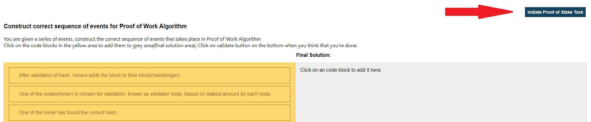
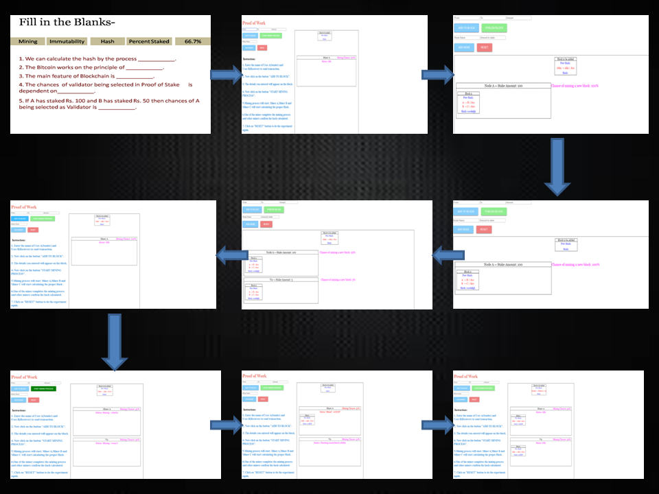

### Procedure

<h4>Steps of simulator </h4> 
                        1. Start with the task regarding concept of Proof of Work. 
                        2. Click on the block to add it into the final solution block. 
                        3. After adding all the blocks correctly as per the instructions, click on validate button. 
                        4. Click in the hint button to get the hint of the wrong question if any and repeat the above process to get all the right answers. 
                        
                        5. Now click on the "Initiate proof of stake task" button to start task regarding concept of Proof of Stake. 
                        6. Click on the block to add it into the final solution block. 
                        7. After adding all the blocks correctly as per the instructions, click on validate button. 
                        8. Click in the hint button to get the hint of the wrong question if any and repeat the above process to get all the right answers. 
                        9. Now click on the "Initiate Proof of Work" button to move on to the PoW page. 
                        10. To Understand the concept of proof of work, Enter the Name and Amount (Cryptocurrency) of the sender as well as the recipient in the placeholder.  
                        11. Click on the 'Add to block' button to complete the details of a particular user. As soon as the button is clicked, the details will get added to the block.  
                        12. Complete the same process for the next user.  
                        13. Now enter the name of the miner to be added. 
                        14. Click on the 'Add Miner' button to add the miner.  
                        15. Complete the same process to add more miners to the block.  
                        16. Click on the start mining process button, to start the mining process. 
                        17. Click on the reset button to reset all the details that were entered by the user. 
                        18. Now click on the "Initiate Proof of Stake" button to move on to the PoS page.  
                        
                        19. To Understand the concept of proof of stake, Enter the Name and Amount (Cryptocurrency) of the sender as well as the recipient in the placeholder.  
                        20. Click on the 'Add to block' button to complete the details of a particular user. As soon as the button is clicked, the details will get added to the block.  
                        21. Complete the same process for the next user.  
                        22. Now enter the name of the node and amount to be added to the stake.  
                        23. Click on the "Publish block" button to publish the block.   
                        24. Click on the reset button to reset all the details that were entered by the user.  
                        25. The instruction pane will also be there to make the user understand about the basic process that is happening in the simulator.   
                        26. Now click on the "Initiate Difference Exercise/Task" button to move on to the task page.  
                        27. Click on the small blocks to select it and then click on the column to which it is related. 
                        28. After adding all the blocks correctly as per the instructions, click on validate button. 
                        29. Click in the reset button to rearrange all to get the right answers. 
                        
                        