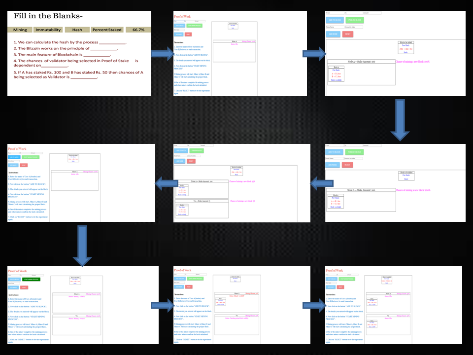
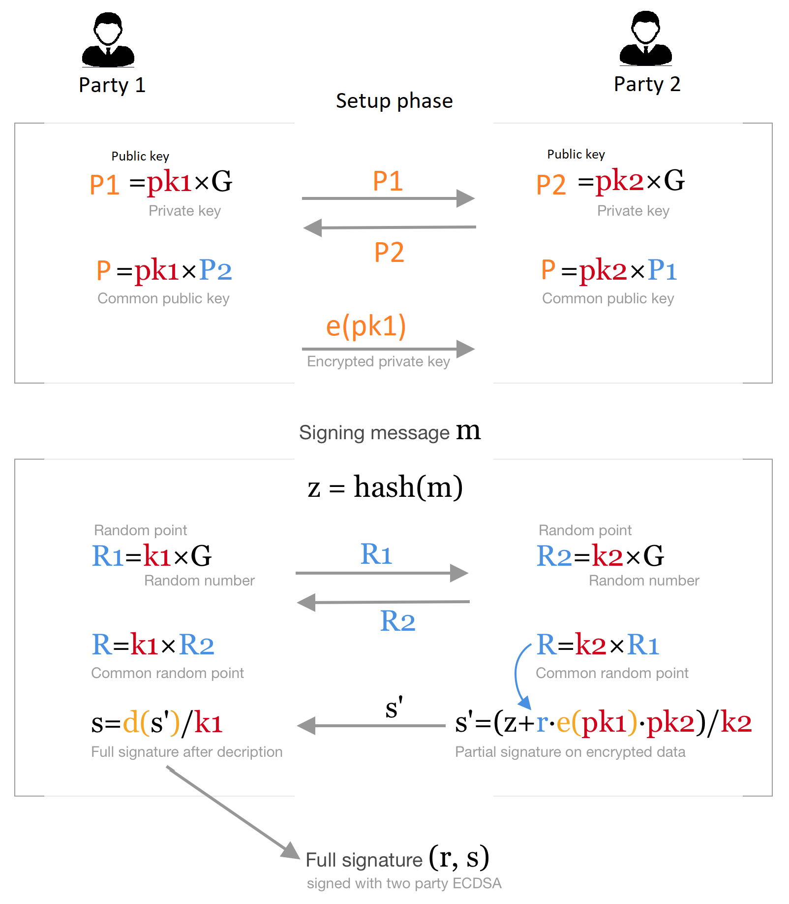

# Round 2

## Experiment 3: Proof of Work and Proof of Stake in Blockchain

### 1. Story Outline :

The user lands into a page where he/she is set to perform a task where he/she has to fill in blanks according to the questions asked regarding Proof of Work and Proof of Stake. If he/she fails to do the test. Then he/she has to read the theory and if he passes the test and he/she has completed the task, he/she moves to the next page of the simulator where he/she 
performs a practical implementation of how Proof of Work and Proof of Stake works. Before he/she enters the simulator. He/She is given an option between Proof of Work and Proof of Stake i.e whose practical implimentation he/she wants see first. If he/she chooses Proof of Work then he/she lands up on Proof of Work simulator page. And if he/she chooses Proof of Stake, he/she lands on the Proof of Work simulator. 

### 2. Story :

The experiment demonstrates the process of how a transaction is being processed and validated through the concept of Proof of Work and Proof of Stake. 
First the details of the transaction is being entered by the user and added to the block. If the user wants,he/she can add another Miner and its name of their choice. User starts the mining process by clicking on the button "START MINING PROCESS". One of the miner calculates the correct hash and after a short while other two miners confirm the hash and the transaction is completed.  

### Page 1
 

### Page 2

#### 2.1 Set the Visual Stage Description:
<h2>Construction of the set-up:</h2>

For better visualization, a simulator is provided. There is a need to illustrate what happens in Proof of Work and Proof of Stake exactly. Since,
performing this experiment in real life is not economically feasible because high end equipments are required to perform these works which are very expensive, so a simulator can always be the 
best alternative. A proper animated environment is given for better understanding of the procedure. First a combined task on Proof of Work and Proof of Stake is represented to recall user's knowledge on mining. Then 
an interactive and animated simulation is performed so that user can understand the concept of Proof of Work and Proof of Stake.  

#### 2.2 Set User Objectives & Goals:
Sr No. |    Learning Objective  | Cognitive Level | Action Verb
:--|:--|:--|:-:
1.| User will be able to:  Recall concept of Proof of Work and Proof of Stake by selecting the correct words to fill in the blanks provided. | Remember | Recall
2.| User will be able to:  Describe how the consensus algorithm's "Proof of Work" is used in mining the blocks in blockchain.  | Understand| Describe
3.| User will be able to:  Describe how the consensus algorithm's "Proof of Stake" is used in validating the blocks in blockchain.  | Understand| Describe

#### 2.3 Set the Pathway Activities:

The simulator tab is divided into three main sections:  
In first section we allow the user : 
To recall his previous knowledge on Proof of Work and Proof of Stake.  
In the second section user : 
Will give required information about the transactions to be added in the block and then this block will be added to the blockchain after clicking on the 'START MINING PROCESS'. And if the user wants he/she can add the miner having name of their own choice. 
In the third section user: 
Will give required information about the transaction to be added in the block. And if further user wants to add a node then he/she will be able to add one. Now the user clicks on 'PUBLISH BLOCK' and thus Node A validates the transaction and after the transaction is being validated. The block is added to the ledger.

#### Pathway Illustration

##### 2.4 Set Challenges and Questions/Complexity/Variations in Questions:

Assessment Questions: 
Task 1: Understanding what is Proof of Work. 

Question : Who validates the hash of the newly mined block? 

Task 2 : Understanding what is Proof of Stake. 

Question : What is the criteria of selection of a node as a Validator? 

Task 3 : Understanding difference between Proof of Work and Proof of Stake. 

Question : What is the difference between Proof of Work and Proof of Stake? 

#### 2.5 Allow Pitfalls:
1. The user fills the blanks from the glossary, but if he fills the wrong words and press validate, the wrong answers are made red and hints for the wrong ones are provided. By this user can read the hint and try again and learn the right answers.
2. In the last exercise if the user distributes the wrong statements they turn red indicating that they are wrong then beacause there are just two choices user correctly places them in the right section and hence learns the righ answers.

#### 2.6 Conclusion:
<dd>In this experiment, the user has learned about the two parts of Consensus Algorithm of Blockchain which are Proof of Work and Proof of Stake. The user undersatands the difference between Proof of Work and Proof of Stake. In Proof of Work, the user understands how addition of other miners affects the chances of miners to mine the block. In Proof of Stake, the user understands how chances of a node being selected as a Validator are affected by the amount staked by various nodes.
</dd>

#### 2.6.1 Assesment:

It takes approx. 15 minutes for an untrained user to completly understand and analyse the simulator.
And about 10 minutes for a trained user to completly understand and analyze the simulator.
Average =(15+10)/2= 12.5 minutes(Simulator is in testing/developing stage)

#### 2.7 Equations/Formulas:

#### Some of the equations used in the simulator:

#### i. SHA-256

 

#### ii. ECDSA (Elliptic Curve Digital Signature Algorithm)

### 3. Flowchart

### 4. Mindmap

 
### 5. Storyboard 

 