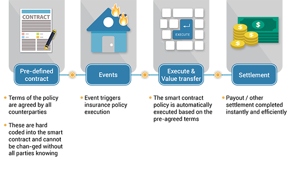

### Aim
In this experiment, the user will learn about a cryptocontract protocol of blockchain i.e. "Smart-Contracts". He/She will learn how a smart contract is
implemented in blockchain and what advantages it has over third party contracts.
### Theory
 <h3>Blockchain Technology</h3>
                     A block chain is basically a living list of records, called as "blocks". These blocks are connected to each other by the diverse cryptographic mechanisms. In the category of data structures, this can be related to the concept of a Linked List. In Block chain, the initial block is known as the "Genesis Block". This naming convention is basically a major commendation to Satoshi Nakamoto. The domain of crypto-currency was pioneered by a bogus naming convention. It can be related to a random scenario of a person or a group of persons, represented by a peculiar name “Satoshi Nakamoto”. In the year 2008, for the purpose of Bitcoin this name was utilized. The technology that was used behind the Bitcoin spectrum was “Block-Chain”. Initially the structure of a block has basically 3 components namely data, hash of current block and hash of previous block. As an illustration in general, the concept of block-chain can be depicted with “m” blocks forming a chain where m can be any random positive integer.
    
<h4>Smart-Contracts in Blockchain</h4>
The origin of the Smart-Contract began in the early 1990's by a versatile computer scientist "Nick Szabo". He is also an expert of the cryptographic domain. With the help of this concept, the user or anyone can avoid the  frauds of a middle men. It can allow anyone to trade currency, property or any valuable thing in a hassle-free manner. The user can compare it with a concept of C-Language i.e. "if-else statement". Same here happens, If one condition is fulfilled,then a particular condition will take place and if a particular condition is not met then, some other task will take place. The smart contracts are commited as codes. That simply means that, when an outline of an event takes place the smart contracts are triggered. For example, if in a corporate private organization, the targets are reached then the bonus will be given to the employees. Here, the bonus is basically the process happened when the code of target is completed. Syntactically, the principle is "if/when....then...", that means if a particular condition is met then a particular action will take place. 
  
<h3>Advantages of Smart Contracts</h3>
There are basically 5 benifits of Smart Contracts that are discussed below: 
1.  Pace 
2.  Correctness 
3.  Belief 
4.  Certainty 
5.  Economizing 

<h3>Some Basic Algorithmic Rules Used</h3>
<h3>SHA-256 and ECDSA</h3>
                    SHA-256 or Secure Hash Algorithm-256 bit is a type of hash function which is commonly used in Blockchain. SHA-256 changes an input from the user to a string which is a mixture of numbers and letter which is created through a cryptographically secure hashing function which is almost 0% similar to the input. SHA-256 is the strongest hash function available in the current scenario and it is a successor of SHA-1. 
                    Eg:- SHA-256 hash of 'abc' will be 'ba7816bf­8f01cfea­414140de­5dae2223­b00361a3­96177a9c­b410ff61­f20015ad' 
                    ECDSA stands for Elliptic Curve Digital Signature Algorithm. ECDSA consists of three parts. 
                    &#9679;&nbsp;Private Key 
                    &#9679;&nbsp;Public Key 
                    &#9679;&nbsp;Signature  
                    <b>Private Key :- </b>It is a number in form of secret key which is known only to the person who owns it and does transactions. Private Key is a randomly generated number which is a single unsigned 256 bit integer. 
                    <b>Public Key :- </b>It is a number generated from Private Key but is not kept secret. A public Key can be determined from Private Key but Private Key cannot be determined from Public Key. A Public Key can be used to determine whether a Signature is genuine or not without requiring Private Key. 
                    <b>Signature :- </b>It is a number that confirms about a signing operation taking place. A Signature is a mathematically generated hash of the signed number and Priavte Key. A Public Key is used to determine whether the signature entered is genuine or not which provides security to the transactions.  
                        
                     
                    
### Procedure

<h4>Steps of simulator </h4> 
                        1. Start with the task regarding concept of smart contract. 
                        2. Click on the block to add it into the final solution block. 
                        3. After adding all the blocks correctly as per the instructions, click on validate button. 
                        4. Click in the hint button to get the hint of the wrong question if any and repeat the above process to get all the right answers. 
                        5. Click on the "Initiate Smart Contract Experiment" button to go to the experiment page.
                        6. To Understand the concept of Smart Contract, Select the type of contract. 
                        7. After selecting the Simple explanation option, Enter the name of sender and the receiver then enter the amount to be sent.  
                        8. Now click on the "ADD TO BLOCK" button to add the block. 
                        9. Complete the same process for the next user. 
                        10. Now click on "PUBLISH VALIDATED BLOCK" button to publish the block. 
                        11. Now after selecting the "DONATION CAMPAIGN EXAMPLE", Enter the Donation campaign name. 
                        12. The information box will also be there to make the user understand about the basic process that is happening in the simulator.  
                        13. Enter the necessary detailes like Username, Target amount and Timelimit(in sec).  
                        14. After that click on the "CREATE CONTRACT" button to create the contract. 
                        15. Now enter the Name of sender and receiver and the amount to be sent in the entered time limit. 
                        16. Click on the "ADD TO BLOCK" button and then repeat the above step to enter another detail.  
                        17. Now click on the "PUBLISH THE VALIDATED BLOCK" button to publish the block.   
                        18. Now the block will be added to the Node A if the block is get published in the given time otherwise the amount will be automatically send back to the doner.  
                        
### Pre Test
1. A smart contract also known as
                         
                        A.<input type="radio" name="but" id="rb11" onclick="click1();">&nbsp;Aleatory contract
                         
                        **B**.<input type="radio" name="but" id="rb12" onclick="click1();">&nbsp;**Cryptocontract**
                         
                        C.<input type="radio" name="but" id="rb13" onclick="click1();">&nbsp;Encrypted contract
                         
                        D.<input type="radio" name="but" id="rb14" onclick="click1();">&nbsp;None of these
                         
                        

                         
 2. A smart contract is a 
                         
                        A. <input type="radio" name="but2" id="rb21" onclick="click2();">&nbsp;Cryptocurrency
                         
                        **B**. <input type="radio" name="but2" id="rb22" onclick="click2();">&nbsp;**Computer program**
                         
                        C. <input type="radio" name="but2" id="rb23" onclick="click2();">&nbsp;Blockchain
                         
                        D. <input type="radio" name="but2" id="rb24" onclick="click2();">&nbsp;None of the above
                          
                        

                         
 
 3. Smart contract enhances
                         
                        **A**. <input type="radio" name="but4" id="rb41" onclick="click4();">&nbsp;**transparency**
                         
                        B. <input type="radio" name="but4" id="rb42" onclick="click4();">&nbsp;cost
                         
                        C. <input type="radio" name="but4" id="rb43" onclick="click4();">&nbsp;time expenditure
                         
                        D. <input type="radio" name="but4" id="rb44" onclick="click4();">&nbsp;Secrecy
                          
                        

                         
4. Smart contract can function as
                        
                        A. <input type="radio" name="but3" id="rb31" onclick="click3();">&nbsp;multi-signature accounts
                         
                        B. <input type="radio" name="but3" id="rb32" onclick="click3();">&nbsp;manage agreement between users
                         
                        C. <input type="radio" name="but3" id="rb33" onclick="click3();">&nbsp;Provide utility to other contracts
                         
                        **D**. <input type="radio" name="but3" id="rb34" onclick="click3();">&nbsp;**All of the above**
                          
                        

                         
5. Smart contract stores
                         
                        **A**.<input type="radio" name="but" id="rb11" onclick="click1();">&nbsp;**Information about an application**
                         
                        B.<input type="radio" name="but" id="rb12" onclick="click1();">&nbsp;hashes
                         
                        C.<input type="radio" name="but" id="rb13" onclick="click1();">&nbsp;recievers address
                         
                        D.<input type="radio" name="but" id="rb14" onclick="click1();">&nbsp;None of these
                         
                        

                         
6. Who invented smart contracts?
                         
                        A.<input type="radio" name="but" id="rb11" onclick="click1();">&nbsp;Satoshi nakamoto
                         
                        **B**.<input type="radio" name="but" id="rb12" onclick="click1();">&nbsp;**Nick Szabo**
                         
                        C.<input type="radio" name="but" id="rb13" onclick="click1();">&nbsp;Johannes Trithemius
                         
                        D.<input type="radio" name="but" id="rb14" onclick="click1();">&nbsp;None of these
                         
                        

                         

### Post Test
1. In which language smart contract can be written?
                         
                        A.<input type="radio" name="but" id="rb11" onclick="click1();">&nbsp;Solidity
                         
                        B.<input type="radio" name="but" id="rb12" onclick="click1();">&nbsp;Serpent
                         
                        C.<input type="radio" name="but" id="rb13" onclick="click1();">&nbsp;Lisp
                         
                      **D**.<input type="radio" name="but" id="rb14" onclick="click1();">&nbsp; **All of the  above**
                         
                        

                         
 2. Who executes the contracts ?
                         
                        A. <input type="radio" name="but2" id="rb21" onclick="click2();">&nbsp;Sender
                         
                        B. <input type="radio" name="but2" id="rb22" onclick="click2();">&nbsp;Receiver
                         
                        **C**. <input type="radio" name="but2" id="rb23" onclick="click2();">&nbsp;**Miner**
                         
                        D. <input type="radio" name="but2" id="rb24" onclick="click2();">&nbsp;None of these
                          
                        

                         
 
 3. Which of the following plateforms uses smart contract?
                         
                        A. <input type="radio" name="but4" id="rb41" onclick="click4();">&nbsp;Ethereum
                         
                        B. <input type="radio" name="but4" id="rb42" onclick="click4();">&nbsp;Bitcoin
                         
                        C. <input type="radio" name="but4" id="rb43" onclick="click4();">&nbsp;Nxt
                         
                        **D**. <input type="radio" name="but4" id="rb44" onclick="click4();">&nbsp;**All of these**
                          
                        

                         
4. In smart contract you don't need to use intermediary service like
                        
                        A. <input type="radio" name="but3" id="rb31" onclick="click3();">&nbsp;brokers 
                         
                        B. <input type="radio" name="but3" id="rb32" onclick="click3();">&nbsp;Agents
                         
                        **C**. <input type="radio" name="but3" id="rb33" onclick="click3();">&nbsp;**Both A and B**
                          
                        

                         
5. How smart contract can be executed?
                         
                        **A**. <input type="radio" name="but4" id="rb41" onclick="click4();">&nbsp;**They can self-verify the conditions placed inside it**
                         
                        B. <input type="radio" name="but4" id="rb42" onclick="click4();">&nbsp;They need to be verified by receiver
                         
                        C. <input type="radio" name="but4" id="rb43" onclick="click4();">&nbsp;Both A and B
                         
                        D. <input type="radio" name="but4" id="rb44" onclick="click4();">&nbsp;None of the above
                          
                        

                         

### References

                        
1. Draft version of “S. Shukla, M. Dhawan, S. Sharma, S. Venkatesan, ‘Blockchain Technology: Cryptocurrency and Applications’, Oxford University Press, 2019. 
2. Josh Thompson, ‘Blockchain: The Blockchain for Beginnings, Guild to Blockchain Technology and Blockchain Programming’, Create Space Independent Publishing Platform, 2017 
3. Hassan, F. U., Ali, A., Latif, S., Qadir, J., Kanhere, S., Singh, J., & Crowcroft, J. (2019). Blockchain And The Future of the Internet: A Comprehensive Review.

<h3>Webliography :</h3>
                         
                        1.&nbsp;https://data-flair.training/blogs/blockchain-terminologies/  
                        2.&nbsp;https://github.com/anders94/blockchain-demo  
                        3.&nbsp;https://anders.com/blockchain/  
                        4.&nbsp;https://blockgeeks.com/guides/what-is-blockchain-technology/  
                        5.&nbsp;https://shecancode.io/blog/an-introduction-to-blockchain-distributed-ledgers  
                        6.&nbsp;https://www.coindesk.com/information/ethereum-smart-contracts-work  
                        7.&nbsp;https://mlsdev.com/blog/156-how-to-build-your-own-blockchain-architecture  
                        8.&nbsp;http://www.conceptfound.com/Misunderstandings-of-Blockchain  
                        9.&nbsp;https://www.coindesk.com/information/what-is-a-decentralized-application-dapp  
                        10.&nbsp;https://mlsdev.com/blog/156-how-to-build-your-own-blockchain-architecture  
                        11.&nbsp;https://www.business-case-analysis.com/ledger.html  
                        12.&nbsp;https://data-flair.training/blogs/blockchain-quiz-test-knowledge/  
                        13.&nbsp;https://uk.wikipedia.org/wiki/%D0%A4%D0%B0%D0%B9%D0%BB:Merkle-Damgard_hash_big.svg  
                        14.&nbsp;https://medium.com/cryptoadvance/ecdsa-is-not-that-bad-two-party-signing-without-schnorr-or-bls-1941806ec36f  
                        15.&nbsp;https://www.capgemini.com/2019/02/why-there-is-so-much-fuss-around-consensus-model-in-blockchain/  
                        16.&nbsp;https://blockgeeks.com/guides/smart-contracts/  
                        17.&nbsp;https://github.com/Savjee/SavjeeCoin   
                        18.&nbsp;https://www.techopedia.com/definition/32530/mining-blockchain  
                        19.&nbsp;https://www.investopedia.com/terms/p/proof-stake-pos.asp  

