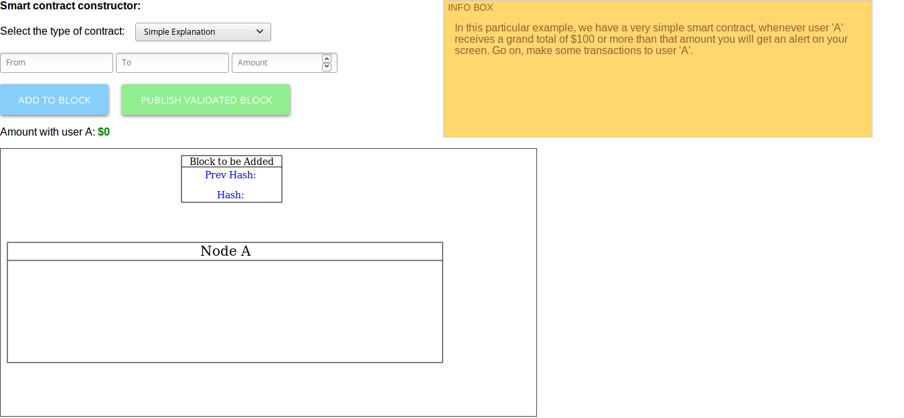
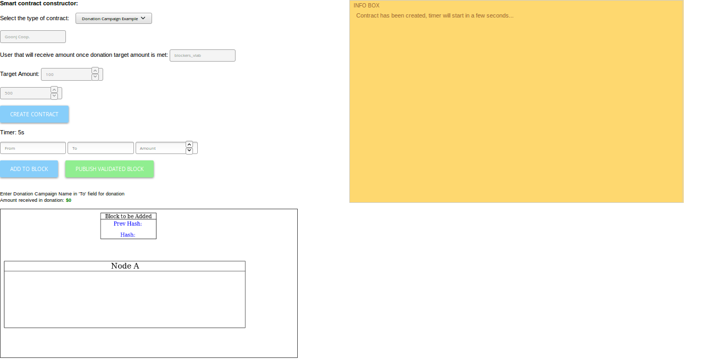
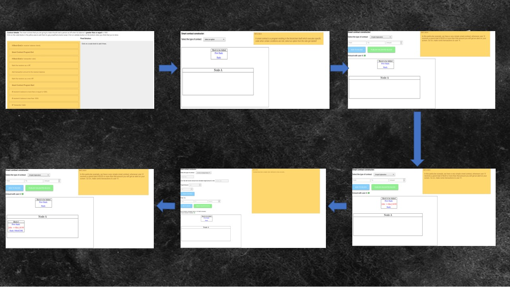
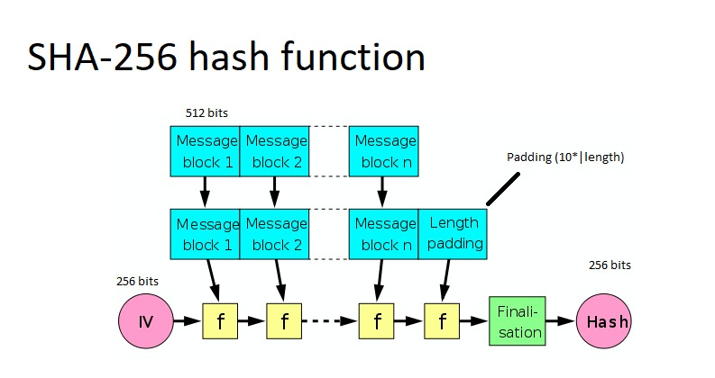
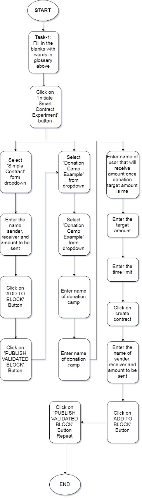
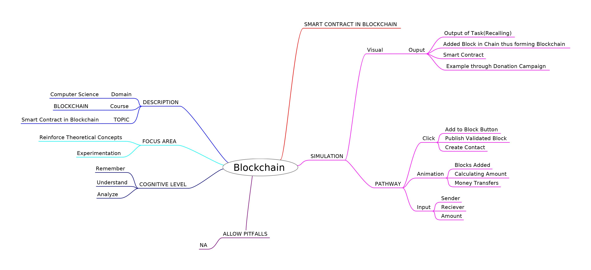
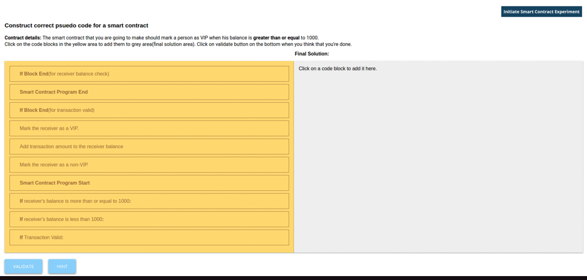

# Round 2

## Experiment 4: Smart Contracts in Blockchain

### 1. Story Outline :

 The user lands into a page where he/she is set to perform a task where he/she has to fill in blanks according to the questions asked regarding Smart Contract in Blockchain. After he/she has completed the task, he/she moves to the next page of the simulator where he/she 
understand what a Smart Contract is.  

### 2. Story :

The experiment demonstrates the process of how Smart Contract works in real world. 
First the details of the transaction is being entered by the user and added to the block. User can then publish the block as a valid block at any time by clicking on the button "Publish Validated Block". Now when user moves to the second page of the simulatotr. He/she moves to an example of Smart Contract via Donation Campaign.  

### Page 1
 

### Page 2

#### 2.1 Set the Visual Stage Description:
<h2>Construction of the set-up:</h2>

For better visualization, a simulator is provided. There is a need to illustrate what happens in Smart Contract. Since,
performing this experiment in real life is not economically feasible, so a simulator can always be the 
best alternative. A proper animated environment is given for better understanding of the procedure. First a task on Smart Contract is represented to recall user's knowledge on mining. Then 
an interactive and animated simulation is performed so that user can understand the working of Smart Contract.  

#### 2.2 Set User Objectives & Goals:
Sr No. |    Learning Objective  | Cognitive Level
:--|:--|:-:
1.| User will be able to:  Recall the concept of Smart Contracts by selecting the correct words to fill the blanks provided. | Remember
2.| User will be able to:  Describe how smart contracts are implemented in blockchain. | Understand
3.| User will be able to:  Dissect the various processes of smart contract and learn its implementation in blockchain. | Analyze

#### 2.3 Set the Pathway Activities:

The simulator tab is divided into three main sections:  
In first section we allow the user : 
To recall his previous knowledge on Smart Contract.  
In the second section user : 
Will give required information about the transactions to be added in the block and then this block will be added to the blockchain after clicking on the 'ADD TO BLOCK'. And then the user can validate the block by clicking on "PUBLISH VALIDATED BLOCK.  
In the third section user: 
Will give required information about the transaction to be added in the block by clicking on "CREATE CONTRACT" button. After that user is asked to enter details of the sender,reciever and the amount to be transacted. If user does so within the time limit he/she has to click on "ADD TO BLOCK" and then to validate the entry, user has to click on "PUBLISH VALIDATED BLOCK".

#### Pathway Illustration

##### 2.4 Set Challenges and Questions/Complexity/Variations in Questions:

Assessment Questions: 
Task 1: Understanding Smart Contract's working. 
Question: What is Smart Contract and how it works?  
Task 2: Platform of Smart Contract 
Question: Define the platform on which Smart Contract works.  
Task 3: Execution of Smart Contract 
Quewstion: Who executes the Smart Contract? 

#### 2.5 Allow Pitfalls:
1. More examples demonstrating smart contract implementation in real world could've been added which would've helped the user to better understand of smart contracts. 

#### 2.6 Conclusion:
<dd>In this experiment, the user has learned about Smart Contract in Blockchain. The user understands how Smart Contract in Blockchain works in real life scenario by using an example of a Donation Campaign. In a donation campaign, a person tries to get a minimum amount of donation say X within a specified time limit. If, however, the donation amount is not met within the specified time period the funds are released back to the donators. Funds are only released to the receiving party when the goal is met.
</dd>

#### 2.6.1 Assesment:

It takes approx. 20 minutes for an untrained user to completly understand and analyse the simulator.
And about 17 minutes for a trained user to completly understand and analyze the simulator.
Average =(20+17)/2= 18.5 minutes(Simulator is in testing/developing stage)

#### 2.7 Equations/Formulas:

#### Some of the equations used in the simulator:

#### i. SHA-256

 

#### ii. ECDSA (Elliptic Curve Digital Signature Algorithm)

### 3. Flowchart

### 4. Mindmap

 
### 5. Storyboard 

 